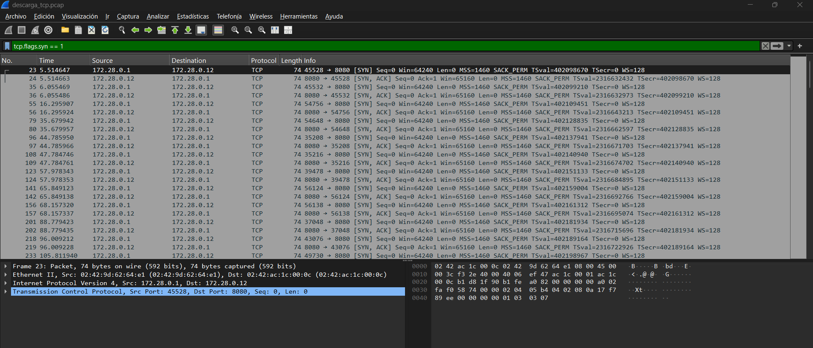
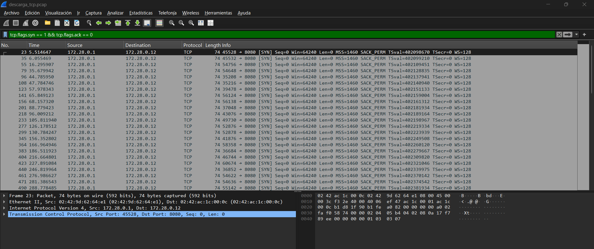
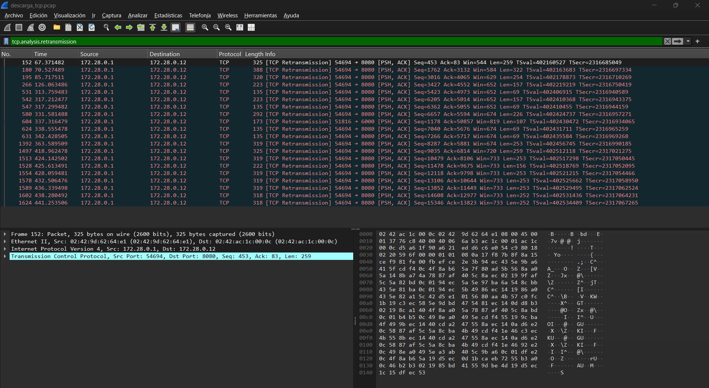
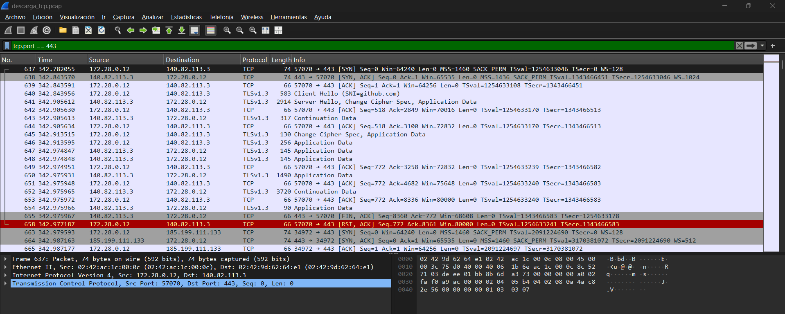
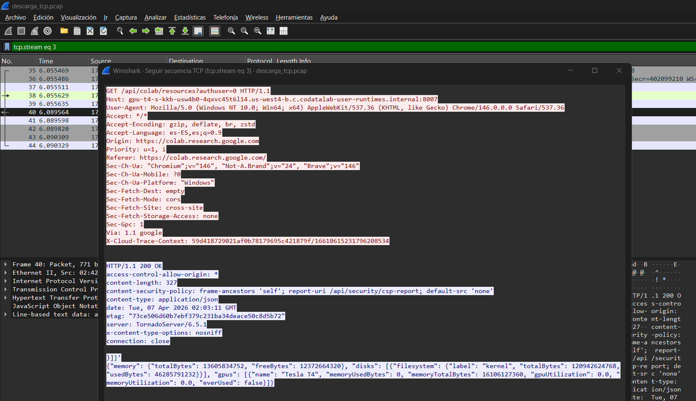
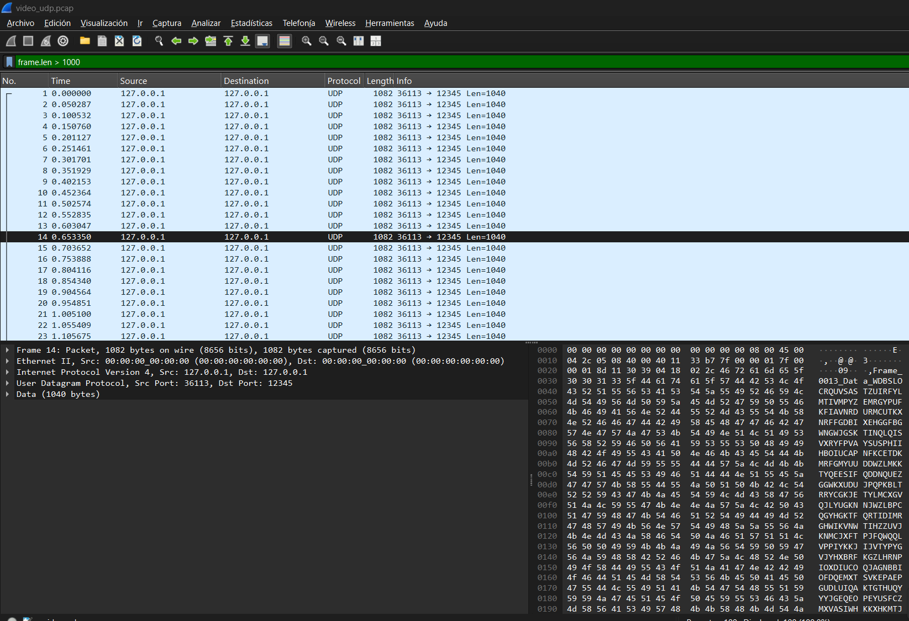
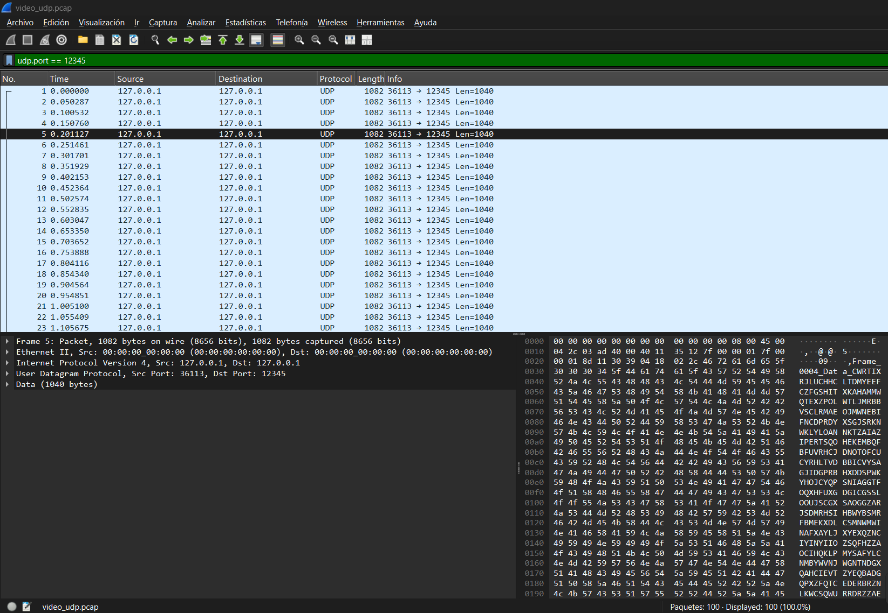
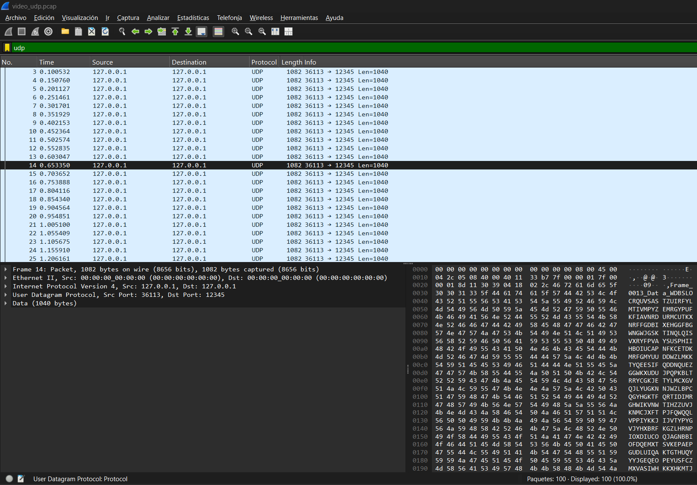

# 🌐 Ejercicio en Clase — Conmutación y Teletráfico

> **Asignatura:** Conmutación y Teletráfico  
> **Institución:** Fundación Universitaria Compensar  
> **Docente:** Diego Alejandro Barragán Vargas  
> **Tema:** Análisis de Tráfico de Red TCP vs UDP con YOLOv8

---

## 📋 Tabla de Contenidos

- [Fase 1 — Tráfico TCP](#-fase-1--análisis-de-la-descarga-tráfico-tcp-confiable)
- [Fase 2 — Tráfico UDP](#-fase-2--análisis-de-la-transmisión-de-video-tráfico-udp-en-tiempo-real)
- [Fase 3 — Análisis con Wireshark](#-fase-3--análisis-forense-con-wireshark)
- [Preguntas y Respuestas](#-preguntas-y-respuestas)
- [Conclusiones](#-conclusiones)

---

## 📖 Descripción General

Este ejercicio analiza el **"rastro" digital** que deja el modelo de visión por computadora **YOLOv8** mientras opera, comparando el comportamiento de sus dos protocolos de red principales: **TCP** y **UDP**.

Se captura tráfico de red real usando `tcpdump` en Google Colab y se analiza visualmente con **Wireshark** en Windows.

---

## ⚙️ Preparación del Entorno

### Paso 1 — Crear el Notebook en Google Colab

1. Ir a Google Colab y crear un nuevo notebook
2. Cambiar el entorno de ejecución: `Entorno de ejecución > Cambiar tipo > GPU`

### Paso 2 — Instalar herramientas

```python
# Instala YOLOv8
!pip install ultralytics -q

# Instala tcpdump
!apt-get update -qq && apt-get install -y -qq tcpdump

print("✅ Entorno listo. Herramientas instaladas.")
```

---

## 🔵 Fase 1 — Análisis de la Descarga (Tráfico TCP Confiable)

Se captura el tráfico de red mientras YOLOv8 descarga su modelo preentrenado. Este proceso utiliza **TCP**.

### Celda 1-A: Iniciar captura TCP

```python
import subprocess, time

tcpdump_proc = subprocess.Popen(
    ["sudo", "tcpdump", "-i", "eth0", "-s", "1500", "-w", "descarga_tcp.pcap"],
    stdout=subprocess.DEVNULL,
    stderr=subprocess.DEVNULL
)
print(f"✅ tcpdump iniciado (PID: {tcpdump_proc.pid})")
time.sleep(2)
```

**Parámetros usados:**

| Parámetro | Descripción |
|---|---|
| `-i eth0` | Selecciona la interfaz de red principal de Colab |
| `-s 1500` | Tamaño de captura de cada paquete (bytes) |
| `-w descarga_tcp.pcap` | Guarda la captura en el archivo indicado |

### Celda 1-B: Generar tráfico TCP (descarga del modelo)

```python
from ultralytics import YOLO

print("⬇️  Descargando modelo YOLOv8n...")
model = YOLO('yolov8n.pt')
print("✅ Modelo descargado y cargado.")
```

### Celda 1-C: Detener captura y descargar

```python
import time
time.sleep(3)
!sudo pkill tcpdump
time.sleep(2)

!ls -lh descarga_tcp.pcap

from google.colab import files
files.download('descarga_tcp.pcap')
print("📥 Archivo descarga_tcp.pcap listo para análisis.")
```

---

## 🟠 Fase 2 — Análisis de la Transmisión de Video (Tráfico UDP en Tiempo Real)

Se simula la transmisión de video desde una cámara web. Para minimizar la latencia, se usa **UDP**, que es más rápido pero no garantiza la entrega de todos los paquetes.

### Celda 2-A: Iniciar captura UDP

```python
import subprocess, time

tcpdump_udp = subprocess.Popen(
    ["sudo", "tcpdump", "-i", "lo", "-s", "1500", "-w", "video_udp.pcap",
     "udp", "and", "port", "12345"],
    stdout=subprocess.DEVNULL,
    stderr=subprocess.DEVNULL
)
print(f"✅ Captura UDP iniciada (PID: {tcpdump_udp.pid})")
time.sleep(2)
```

> ℹ️ Se usa `-i lo` (loopback) porque el tráfico se envía a `127.0.0.1`

### Celda 2-B: Simular transmisión de video (100 fotogramas a 20 FPS)

```python
import socket, time, random

UDP_IP    = "127.0.0.1"
UDP_PORT  = 12345
FRAME_SIZE = 1024

sock = socket.socket(socket.AF_INET, socket.SOCK_DGRAM)

print("📹 Iniciando transmisión de video simulada (UDP)...")
for i in range(100):
    header  = f"Frame_{i:04d}_Data_"
    payload = ''.join(random.choices('ABCDEFGHIJKLMNOPQRSTUVWXYZ', k=FRAME_SIZE))
    message = header + payload
    sock.sendto(message.encode(), (UDP_IP, UDP_PORT))
    if i % 20 == 0:
        print(f"  📤 Frame {i}/100 enviado — {len(message.encode())} bytes")
    time.sleep(0.05)   # 20 FPS

sock.close()
print("✅ Transmisión finalizada.")
```

### Celda 2-C: Detener captura y descargar

```python
import time
time.sleep(3)
!sudo pkill tcpdump
time.sleep(2)

!ls -lh video_udp.pcap

from google.colab import files
files.download('video_udp.pcap')
print("📥 Archivo video_udp.pcap listo para análisis.")
```

---

## 🔬 Fase 3 — Análisis Forense con Wireshark

Se abrieron los dos archivos `.pcap` en **Wireshark** en Windows y se aplicaron los filtros indicados en el ejercicio.

---

### 🔍 Análisis del archivo `descarga_tcp.pcap`

#### Filtro: `tcp.flags.syn == 1` — Three-Way Handshake completo (SYN + SYN-ACK)

Muestra tanto los paquetes SYN (inicio de conexión del cliente) como los SYN-ACK (respuesta del servidor), evidenciando el handshake de TCP.



---

#### Filtro: `tcp.flags.syn == 1 && tcp.flags.ack == 0` — Solo paquetes SYN

Filtra únicamente los paquetes SYN puros (sin el ACK), es decir, el primer paso del three-way handshake donde el cliente solicita abrir la conexión.



> Se observan múltiples conexiones TCP iniciadas desde `172.28.0.1` hacia `172.28.0.12` en el puerto 8080, cada una con `Seq=0` y parámetros MSS=1460, SACK_PERM y Window Scaling, que son características estándar de TCP moderno.

---

#### Filtro: `tcp.analysis.retransmission` — Retransmisiones TCP

Muestra los paquetes que tuvieron que reenviarse porque el receptor no confirmó su llegada a tiempo.



> Se detectaron múltiples retransmisiones marcadas como `[TCP Retransmission]`, todas entre `172.28.0.1 → 172.28.0.12` en el puerto 8080. Esto evidencia que TCP detectó pérdidas y las corrigió automáticamente, garantizando la integridad de la descarga.

---

#### Filtro: `tcp.port == 443` — Tráfico HTTPS hacia GitHub/Ultralytics

Aísla la sesión HTTPS usada para descargar el modelo `yolov8n.pt` desde los servidores de Ultralytics (hosteados en GitHub CDN: `140.82.113.3` y `185.199.111.133`).



> Se puede observar claramente la secuencia completa: **SYN → SYN-ACK → ACK** (handshake), seguido de **TLS ClientHello / ServerHello** (negociación de cifrado), **Application Data** (el modelo cifrado) y finalmente **FIN-ACK** (cierre de conexión). El paquete en rojo (frame 658) muestra un `[RST, ACK]`, indicando que una conexión fue reiniciada.

---

#### Follow TCP Stream — Conversación HTTP completa

Visualización de la conversación TCP completa que Colab establece con el servidor para coordinar la descarga.



> El stream muestra una petición `GET /api/colab/resources` hacia el servidor interno de Google Colab (`gpu-t4-s-kkb-usw4b0...`), con respuesta `HTTP/1.1 200 OK` y datos JSON que incluyen información del entorno de ejecución (memoria, GPU Tesla T4, discos).

---

### 🔍 Análisis del archivo `video_udp.pcap`

#### Filtro: `frame.len > 1000` — Paquetes grandes (fotogramas simulados)

Filtra únicamente los paquetes cuyo tamaño supera los 1000 bytes, que corresponden a los fotogramas de video simulados.



> Todos los paquetes son UDP de **1082 bytes** (1040 bytes de datos + headers), enviados desde el puerto `36113` al puerto `12345`, con un intervalo de ~50ms entre cada uno (20 FPS simulados). Se confirma la transmisión de 100 fotogramas de forma perfectamente regular.

---

#### Filtro: `udp.port == 12345` — Stream completo de video UDP

Muestra todos los paquetes del stream de video, confirmando que los 100 fotogramas llegaron al destino.



> Se observan exactamente **100 paquetes** (mostrado en la barra inferior: "Paquetes: 100 · Displayed: 100"), todos UDP de 1082 bytes, desde `127.0.0.1:36113 → 127.0.0.1:12345`. El panel inferior confirma la estructura: `User Datagram Protocol, Src Port: 36113, Dst Port: 12345` y `Data (1040 bytes)`.

---

#### Filtro: `udp` — Protocolo UDP puro

Vista general de todo el tráfico UDP capturado, sin ningún overhead de control ni handshake.



> A diferencia del tráfico TCP, **no hay paquetes de control, ACKs ni retransmisiones**. UDP simplemente envía los datos y continúa. Los 100 frames se transmitieron en aproximadamente 5 segundos a intervalos regulares de 50ms, demostrando la baja latencia característica de UDP.

---

## ❓ Preguntas y Respuestas

---

### Pregunta 1 — ¿Qué es YOLO, cuáles son sus características principales y qué arquitectura tiene?

**YOLO** (*You Only Look Once*) es un algoritmo de detección de objetos en tiempo real basado en redes neuronales convolucionales (CNN). A diferencia de métodos anteriores que analizaban regiones de la imagen múltiples veces, YOLO procesa la imagen completa en una **única pasada** por la red neuronal, prediciendo simultáneamente las cajas delimitadoras (*bounding boxes*) y las clases de los objetos detectados.

#### Características principales

- **Una sola pasada (single forward pass):** Detecta todos los objetos en una imagen en una única inferencia, lo que lo hace extremadamente rápido
- **Velocidad en tiempo real:** Capaz de procesar entre 30 y 160+ FPS según la versión y el hardware disponible
- **Visión global del contexto:** Al analizar la imagen completa, aprende relaciones espaciales entre objetos, reduciendo falsos positivos respecto a métodos de ventana deslizante
- **Multitarea:** Detecta múltiples objetos de múltiples clases simultáneamente en la misma pasada
- **Versatilidad (YOLOv8):** Soporta detección de objetos, segmentación de instancias, clasificación de imágenes y estimación de pose corporal en un solo framework

#### Arquitectura de YOLOv8

```
  Imagen de entrada (ej. 640x640 px)
           │
           ▼
  ┌─────────────────────────┐
  │        BACKBONE         │
  │   CSPDarknet + C2f      │  ← Extrae características visuales
  │   (Conv + BN + SiLU)    │    Produce feature maps multi-escala:
  │                         │    P3(80x80), P4(40x40), P5(20x20)
  └────────────┬────────────┘
               │
               ▼
  ┌─────────────────────────┐
  │          NECK           │
  │   PAN-FPN               │  ← Fusiona características de distintas
  │   (Path Aggregation     │    resoluciones: detecta objetos
  │    Feature Pyramid Net) │    grandes Y pequeños con precisión
  └────────────┬────────────┘
               │
               ▼
  ┌─────────────────────────┐
  │          HEAD           │
  │   Decoupled Detection   │  ← Dos ramas separadas:
  │   Head                  │    · Regresión: (x, y, w, h)
  │                         │    · Clasificación: clase del objeto
  └────────────┬────────────┘
               │
               ▼
      NMS (Non-Maximum Suppression)
      Elimina detecciones duplicadas
               │
               ▼
      Salida: [bbox, clase, confianza]
```

---

### Pregunta 2 — ¿Por qué la descarga usa TCP y la transmisión de video usa UDP?

#### Comparativa de protocolos

| Característica | TCP | UDP |
|---|---|---|
| Orientado a conexión | ✅ Sí (three-way handshake) | ❌ No (connectionless) |
| Garantía de entrega | ✅ Sí (ACK + retransmisión) | ❌ No |
| Control de flujo | ✅ Sí (sliding window) | ❌ No |
| Orden de paquetes | ✅ Garantizado (números de secuencia) | ❌ No garantizado |
| Velocidad | 🟡 Moderada (overhead de control) | ✅ Alta (header mínimo de 8 bytes) |
| Latencia | 🟡 Mayor | ✅ Mínima |
| Uso típico | Archivos, HTTPS, correo | Streaming, VoIP, gaming en vivo |

#### ¿Por qué TCP para descargar el modelo?

El archivo `yolov8n.pt` contiene los pesos serializados de una red neuronal (~6.2 MB). Si un solo byte llega corrupto o falta, el modelo no puede deserializarse. Las capturas de Wireshark confirman esto:

- Se observó el **three-way handshake** completo antes de cualquier dato
- Se detectaron **retransmisiones automáticas** (`tcp.analysis.retransmission`) que TCP corrigió sin intervención manual
- La sesión usó **TLS 1.3** (puerto 443) para cifrar la transferencia de forma segura

TCP actúa como un "servicio postal certificado": garantiza que cada byte llega, en orden y sin errores.

#### ¿Por qué UDP para transmisión de video en tiempo real?

Las capturas de `video_udp.pcap` muestran el contraste directo:

- **Cero paquetes de control** — no hay SYN, ACK ni FIN
- **100 paquetes enviados = 100 paquetes en la captura** — sin overhead adicional
- **Intervalos regulares de ~50ms** — latencia constante y predecible

En video en vivo, si un fotograma se pierde, **no tiene sentido retransmitirlo** — para cuando llegara, ya habría pasado su momento. UDP prioriza la continuidad del flujo sobre la integridad individual de cada paquete.

> 💡 **Principio clave:** Para video en tiempo real, un dato que llega **tarde** es peor que un dato **perdido**.

---

### Pregunta 3 — Fiabilidad vs. Velocidad: ¿Qué significan las retransmisiones TCP?

#### Evidencia en la captura real

El filtro `tcp.analysis.retransmission` en `descarga_tcp.pcap` reveló múltiples retransmisiones:


Wireshark marcó estos paquetes con la etiqueta `[TCP Retransmission]`, todos con protocolo **PSH, ACK**, lo que indica que eran segmentos de datos (no solo control) que tuvieron que reenviarse.

#### ¿Qué significa que aparezcan retransmisiones?

Significa que el emisor (`172.28.0.1`) no recibió el ACK esperado dentro del tiempo de espera (RTO — *Retransmission Timeout*), lo que indica que:

1. El paquete original se perdió en la red (descartado por congestión)
2. O el ACK del receptor se perdió antes de llegar al emisor

TCP detectó la ausencia del ACK y reenvió el segmento automáticamente, asegurando que el archivo llegara completo.

#### ¿Por qué es crucial para archivos pero perjudicial para video en vivo?

| Escenario | Efecto en descarga de archivo | Efecto en video en vivo |
|---|---|---|
| Paquete perdido | Se retransmite → archivo íntegro ✅ | Se retransmite → video congelado ❌ |
| Retransmisión tarda 150ms | Descarga 150ms más lenta (aceptable) | 4-5 frames perdidos de fluidez (inaceptable) |
| 5% de pérdida | TCP recupera todo silenciosamente | Buffer acumulado → desincronización total |

En una transmisión a 30 FPS, cada frame dura ~33ms. Una sola retransmisión introduce al menos 100–300ms de retraso — el equivalente a congelar la imagen durante 3 a 9 fotogramas consecutivos.

---

### Pregunta 4 — Identificando el Origen: Uso de `ip.dst` e `ip.src` en Wireshark

#### IP del servidor identificada en la captura

Aplicando el filtro `tcp.port == 443`, la captura reveló que el modelo fue descargado desde dos servidores del CDN de GitHub:

- `140.82.113.3` — GitHub primary
- `185.199.111.133` — GitHub CDN (Fastly)

Esto se confirmó visualmente en la captura con el filtro `tcp.port == 443`:


#### Filtros para aislar el tráfico con el servidor

```wireshark
# Todo el tráfico bidireccional con el servidor primario de GitHub
ip.addr == 140.82.113.3

# Solo paquetes que VAN al servidor (Colab → GitHub)
ip.dst == 140.82.113.3

# Solo paquetes que VIENEN del servidor (GitHub → Colab)
ip.src == 140.82.113.3

# Filtro combinado: solo la sesión HTTPS de descarga del modelo
ip.addr == 140.82.113.3 && tcp.port == 443

# Para incluir ambos servidores CDN
(ip.addr == 140.82.113.3 || ip.addr == 185.199.111.133) && tcp.port == 443
```

#### ¿Qué muestra este filtro?

Al aplicar `ip.addr == 140.82.113.3 && tcp.port == 443`, Wireshark muestra exclusivamente la sesión de descarga:

1. **SYN / SYN-ACK / ACK** — Establecimiento de la conexión TCP
2. **TLS ClientHello / ServerHello** — Negociación del cifrado (visible en la captura como `Client Hello (SNI=github.com)`)
3. **Application Data** — Los fragmentos del archivo `yolov8n.pt` cifrados con TLS 1.3
4. **FIN / RST-ACK** — Cierre de la conexión al finalizar la descarga

Esto elimina del análisis todo tráfico irrelevante como DNS, NTP o las conexiones internas de Colab al puerto 8080.

---

<div align="center">

**Fundación Universitaria Compensar** · Telecomunicaciones · 2025

</div>