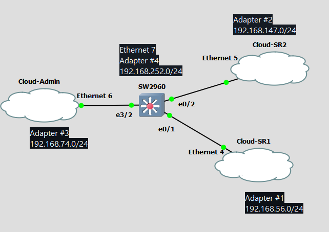
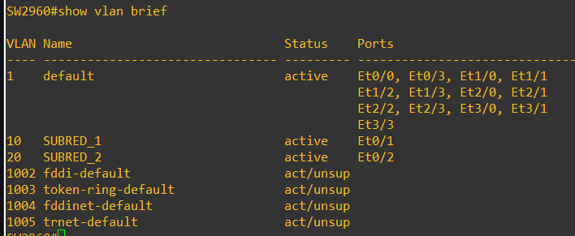
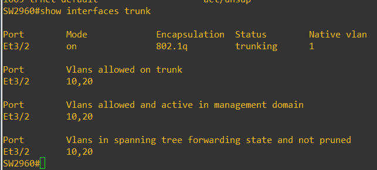
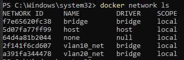
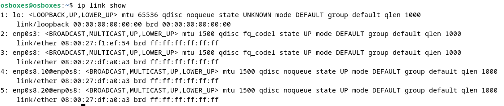
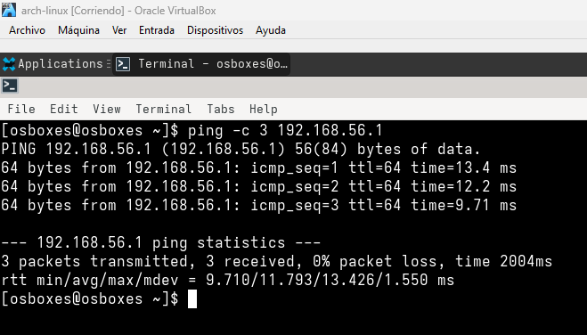

# Laboratorio 2 — Punto 1: Monitoreo con Grafana, Zabbix y pmacct
**Asignatura:** Conmutación y Teletráfico  
**Docente:** Diego Alejandro Barragán Vargas — Fundación Universitaria Compensar

---

## Tabla de Contenidos
1. [Resumen de infraestructura real](#1-resumen-de-infraestructura-real)
2. [Topología en GNS3](#2-topología-en-gns3)
3. [Paso 1 — Configuración del Switch IOU L2 en GNS3](#3-paso-1--configuración-del-switch-iou-l2-en-gns3)
4. [Paso 2 — Redes Docker Desktop en Windows](#4-paso-2--redes-docker-desktop-en-windows)
5. [Paso 3 — Admin VM Debian](#5-paso-3--admin-vm-debian)
6. [Paso 4 — Nodos SubRed 1](#6-paso-4--nodos-subred-1)
7. [Paso 5 — Nodos SubRed 2](#7-paso-5--nodos-subred-2)
8. [Paso 6 — pmacct: NetFlow + sFlow + IPFIX](#8-paso-6--pmacct-netflow--sflow--ipfix)
9. [Paso 7 — Zabbix](#9-paso-7--zabbix)
10. [Paso 8 — Grafana y Dashboard](#10-paso-8--grafana-y-dashboard)
11. [Paso 9 — Generación de tráfico con iPerf3](#11-paso-9--generación-de-tráfico-con-iperf3)
12. [Paso 10 — Captura con Wireshark](#12-paso-10--captura-con-wireshark)
13. [Respuestas a preguntas del laboratorio](#13-respuestas-a-preguntas-del-laboratorio)

---

## 1. Resumen de infraestructura real

### Decisión de arquitectura: captura directa en subinterfaces (sin SPAN)

Durante el desarrollo se evaluaron tres enfoques para la captura de tráfico:

1. **SPAN basado en VLANs en IOU L2** → El IOU L2 no soporta `monitor session source vlan`. Descartado.
2. **SPAN basado en interfaces físicas en IOU L2** → El IOU L2 tampoco reconoce `monitor session source interface` de forma funcional. Descartado.
3. **IOSvL2 con SPAN completo** → Requiere KVM. La GNS3 VM corriendo sobre VirtualBox no soporta nested KVM. Descartado.

**Solución adoptada — Captura directa en las subinterfaces VLAN del Admin VM.**

Como el Admin VM actúa como router-on-a-stick entre VLAN 10 y VLAN 20, todo el tráfico inter-VLAN pasa obligatoriamente por sus subinterfaces `enp0s8.10` y `enp0s8.20`. softflowd, pmacct y tshark leen directamente de estas subinterfaces, logrando el mismo objetivo que el SPAN para el tráfico inter-VLAN relevante a las pruebas del laboratorio.

> **Limitación documentada:** Esta estrategia no captura tráfico intra-VLAN (comunicación directa entre dos hosts de la misma VLAN sin pasar por el gateway). Para los objetivos de este laboratorio — pruebas iPerf3 entre subredes distintas — esto no afecta el resultado.

### Adaptadores Host-Only de VirtualBox

| Adaptador Windows | Host-Only VirtualBox | IP del Host Windows | Uso en el laboratorio |
|---|---|---|---|
| Ethernet 4 | Adapter #1 | 192.168.56.1/24 | Cloud-SR1 → SubRed 1 |
| Ethernet 5 | Adapter #2 | 192.168.147.1/24 | Cloud-SR2 → SubRed 2 |
| Ethernet 6 | Adapter #3 | 192.168.74.1/24 | Cloud-Admin → trunk Admin VM |
| Ethernet 7 | Adapter #4 | 192.168.252.1/24 | GNS3 VM (exclusivo) |

> El adaptador Host-Only #5 (Ethernet 8 / Cloud-SPAN) ya no se utiliza. El Admin VM pasa de tres adaptadores a dos.

### Tabla de IPs del laboratorio

| Nodo | Tipo | SubRed | VLAN | IP | Gateway |
|---|---|---|---|---|---|
| Admin VM enp0s8.10 | Subinterfaz | 1 | 10 | 192.168.56.1/24 | — |
| Admin VM enp0s8.20 | Subinterfaz | 2 | 20 | 192.168.147.1/24 | — |
| GNS3 VM | VM Ubuntu | — | — | 192.168.252.100 | 192.168.252.1 |
| Arch Linux VM | VM VirtualBox | 1 | 10 | 192.168.56.10/24 | 192.168.56.1 |
| Rocky Linux VM | VM VirtualBox | 1 | 10 | 192.168.56.20/24 | 192.168.56.1 |
| Fedora Container | Docker Desktop | 1 | 10 | 192.168.56.30/24 | 192.168.56.1 |
| Ubuntu VM | VM VirtualBox | 2 | 20 | 192.168.147.10/24 | 192.168.147.1 |
| Alpine Container | Docker Desktop | 2 | 20 | 192.168.147.20/24 | 192.168.147.1 |
| Kali Container | Docker Desktop | 2 | 20 | 192.168.147.30/24 | 192.168.147.1 |

### Nombres de interfaces de red en Debian (Admin VM)

```bash
ip link show
```

Resultado típico en VirtualBox (dos adaptadores):

```
1: lo          → loopback (ignorar)
2: enp0s3      → Adaptador 1 — NAT (internet)
3: enp0s8      → Adaptador 2 — Host-Only #3 (trunk al switch)
```

> A lo largo de este README se usan los nombres `enp0s3` y `enp0s8`.
> Si en tu equipo aparecen nombres distintos, reemplázalos en todos los comandos.

### Puertos del Switch IOU L2

| Puerto Switch | Modo | Conectado a | Propósito |
|---|---|---|---|
| e3/2 | Trunk (VLAN 10,20) | Cloud-Admin (Ethernet 6) | trunk Admin VM enp0s8 |
| e0/1 | Access VLAN 10 | Cloud-SR1 (Ethernet 4) | SubRed 1 |
| e0/2 | Access VLAN 20 | Cloud-SR2 (Ethernet 5) | SubRed 2 |

> El puerto SPAN (e0/3) y el Cloud-SPAN ya no forman parte de la topología.

---

## 2. Topología en GNS3



```
                    Admin VM — Debian (VirtualBox)
                   enp0s3    → NAT (internet)
                   enp0s8    → Ethernet 6 / Host-Only #3 (trunk)
                   enp0s8.10 → 192.168.56.1  (gateway SubRed 1)
                   enp0s8.20 → 192.168.147.1 (gateway SubRed 2)
                          │
                    Cloud-Admin
                    Ethernet 6
                          │
                        e3/2
                      SW2960 IOU L2
                        (GNS3 VM)
                    e0/1         e0/2
                      │             │
                 Cloud-SR1      Cloud-SR2
                 Ethernet4      Ethernet5
               192.168.56.x   192.168.147.x
                      │             │
       ┌──────────────┤         ┌───┤
  Arch Linux   Rocky Linux   Ubuntu   Alpine   Kali
  VM           VM            VM       Cont.    Cont.
  .56.10       .56.20        .147.10  .147.20  .147.30
  Fedora Container
  .56.30
(VirtualBox / Docker Desktop en Windows 11)

Captura de tráfico (sin SPAN):
  softflowd → enp0s8.10 + enp0s8.20 → NetFlow v9 → 127.0.0.1:2055
  pmacctd   → enp0s8.10 + enp0s8.20 → sFlow v5   → 127.0.0.1:6343
  pmacctd   → enp0s8.10 + enp0s8.20 → IPFIX      → 127.0.0.1:4739
  tshark    → enp0s8.10 + enp0s8.20 → .pcap
```

### Nodos en GNS3

| Nodo GNS3 | Tipo | Interfaz Windows |
|---|---|---|
| SW2960 | Switch IOU L2 | — |
| Cloud-Admin | Cloud node | Ethernet 6 |
| Cloud-SR1 | Cloud node | Ethernet 4 |
| Cloud-SR2 | Cloud node | Ethernet 5 |

---

## 3. Paso 1 — Configuración del Switch IOU L2 en GNS3

Hacer clic derecho sobre el switch en GNS3 → Console.

```cisco
enable
configure terminal

! === PASO 1: Crear VLANs ===
vlan 10
 name SUBRED_1
vlan 20
 name SUBRED_2
exit

! === PASO 2: Puerto trunk hacia Admin VM (e3/2) ===
interface ethernet 3/2
 switchport trunk encapsulation dot1q
 switchport mode trunk
 switchport trunk allowed vlan 10,20
 no shutdown
exit

! === PASO 3: Puerto acceso SubRed 1 (e0/1) ===
interface ethernet 0/1
 switchport mode access
 switchport access vlan 10
 spanning-tree portfast
 no shutdown
exit

! === PASO 4: Puerto acceso SubRed 2 (e0/2) ===
interface ethernet 0/2
 switchport mode access
 switchport access vlan 20
 spanning-tree portfast
 no shutdown
exit

! === PASO 5: IP de gestión y SNMP ===
interface vlan 1
 ip address 192.168.56.100 255.255.255.0
 no shutdown
exit
ip default-gateway 192.168.56.1

snmp-server community public RO
snmp-server community private RW
snmp-server location "Laboratorio_Compensar"
snmp-server contact "admin@lab.com"
snmp-server host 192.168.74.1 public

! === PASO 6: Guardar configuración ===
end
write memory
```

> **Nota:** No se configura SPAN. El IOU L2 no soporta `monitor session` de forma funcional.
> La captura de tráfico se realiza directamente en las subinterfaces del Admin VM (ver Paso 6).

### Verificación

```cisco
show vlan brief
show interfaces trunk
show running-config
```


---

## 4. Paso 2 — Redes Docker Desktop en Windows

Abrir **PowerShell como Administrador**.

```powershell
docker network create --driver bridge --subnet 192.168.56.0/24 --gateway 192.168.56.1 --opt "com.docker.network.bridge.name=br-vlan10" vlan10_net
docker network create --driver bridge --subnet 192.168.147.0/24 --gateway 192.168.147.1 --opt "com.docker.network.bridge.name=br-vlan20" vlan20_net

# Verificar
docker network ls
```


---

## 5. Paso 3 — Admin VM Debian

La VM Debian en VirtualBox debe tener **dos adaptadores**:
- **Adaptador 1:** NAT → `enp0s3` (internet)
- **Adaptador 2:** Host-Only Adapter #3 → `enp0s8` (trunk al switch e3/2)

> El tercer adaptador (SPAN) ya no es necesario.

### 5.1 Verificar nombres de interfaces

```bash
ip link show
```

Resultado esperado:
```
1: lo: <LOOPBACK>
2: enp0s3: <BROADCAST>    ← NAT
3: enp0s8: <BROADCAST>    ← trunk al switch
```

### 5.2 Instalación de paquetes

```bash

wget https://repo.zabbix.com/zabbix/6.0/debian/pool/main/z/zabbix-release/zabbix-release_latest+debian12_all.deb
sudo dpkg -i zabbix-release_latest+debian12_all.deb
sudo apt update

sudo apt install -y vlan wireshark tshark iperf3 \
zabbix-server-mysql zabbix-frontend-php zabbix-apache-conf zabbix-sql-scripts zabbix-agent \
mariadb-server \
pmacct softflowd \
snmp snmpd snmp-mibs-downloader \
curl gnupg apt-transport-https \
net-tools tcpdump

#Verificar
apt policy zabbix-server-mysql
```

### 5.3 Configuración de interfaces de red

```bash
# Cargar módulo 802.1q
sudo modprobe 8021q
echo "8021q" | sudo tee -a /etc/modules
```

Editar el archivo de interfaces:
```bash
sudo nano /etc/network/interfaces
```

Contenido completo del archivo:
```
# Loopback
auto lo
iface lo inet loopback

# Interfaz NAT — internet
auto enp0s3
iface enp0s3 inet dhcp

# Interfaz trunk hacia switch GNS3
auto enp0s8
iface enp0s8 inet manual
    up ip link set enp0s8 up

# Subinterfaz VLAN 10 — Gateway SubRed 1
# También actúa como punto de captura de tráfico (softflowd / pmacct)
auto enp0s8.10
iface enp0s8.10 inet static
    address 192.168.56.1
    netmask 255.255.255.0
    vlan-raw-device enp0s8

# Subinterfaz VLAN 20 — Gateway SubRed 2
# También actúa como punto de captura de tráfico (softflowd / pmacct)
auto enp0s8.20
iface enp0s8.20 inet static
    address 192.168.147.1
    netmask 255.255.255.0
    vlan-raw-device enp0s8
```

Aplicar la configuración:
```bash
sudo ifup enp0s8
sudo ifup enp0s8.10
sudo ifup enp0s8.20

# Verificar
ip addr show enp0s8.10
ip addr show enp0s8.20
```


### 5.4 Habilitar IP forwarding (router-on-a-stick)

```bash
sudo sysctl -w net.ipv4.ip_forward=1
echo "net.ipv4.ip_forward=1" | sudo tee -a /etc/sysctl.conf

# Verificar
sysctl net.ipv4.ip_forward
# Debe mostrar: net.ipv4.ip_forward = 1
```

### 5.5 Verificar conectividad

```bash
ping -c 3 192.168.56.1    # propio gateway SR1
ping -c 3 192.168.147.1   # propio gateway SR2
```

---

## 6. Paso 4 — Nodos SubRed 1

### 6.1 Arch Linux VM (192.168.56.10)

**Configuración VirtualBox:**
- Adaptador 1: NAT
- Adaptador 2: Host-Only Adapter #1 (Ethernet 4)

```bash
ip link show

sudo tee /etc/systemd/network/20-hostonly.network <<EOF
[Match]
Name=enp0s8

[Network]
Address=192.168.56.10/24
Gateway=192.168.56.1
DNS=8.8.8.8
EOF

sudo systemctl enable --now systemd-networkd
sudo systemctl restart systemd-networkd

ip addr show enp0s8
ping -c 3 192.168.56.1
```


Instalar Zabbix Agent e iPerf3:
```bash
sudo pacman -Sy zabbix-agent iperf3

sudo sed -i 's/^Server=.*/Server=192.168.56.1/' /etc/zabbix/zabbix_agentd.conf
sudo sed -i 's/^ServerActive=.*/ServerActive=192.168.56.1/' /etc/zabbix/zabbix_agentd.conf
sudo sed -i 's/^Hostname=.*/Hostname=Arch-Linux-VM/' /etc/zabbix/zabbix_agentd.conf

sudo systemctl enable --now zabbix-agentd
```

### 6.2 Rocky Linux VM (192.168.56.20)

**Configuración VirtualBox:**
- Adaptador 1: NAT
- Adaptador 2: Host-Only Adapter #1 (Ethernet 4)

```bash
ip link show
sudo nmcli con show

sudo nmcli con mod "Wired connection 1" \
  ipv4.addresses 192.168.56.20/24 \
  ipv4.gateway 192.168.56.1 \
  ipv4.dns 8.8.8.8 \
  ipv4.method manual

sudo nmcli con up "Wired connection 1"

ip addr show
ping -c 3 192.168.56.1
```

Instalar Zabbix Agent e iPerf3:
```bash
sudo rpm -Uvh https://repo.zabbix.com/zabbix/6.4/rhel/9/x86_64/zabbix-release-6.4-1.el9.noarch.rpm
sudo dnf install -y zabbix-agent iperf3

sudo sed -i 's/^Server=.*/Server=192.168.56.1/' /etc/zabbix/zabbix_agentd.conf
sudo sed -i 's/^ServerActive=.*/ServerActive=192.168.56.1/' /etc/zabbix/zabbix_agentd.conf
sudo sed -i 's/^Hostname=.*/Hostname=Rocky-Linux-VM/' /etc/zabbix/zabbix_agentd.conf

sudo systemctl enable --now zabbix-agent
```

### 6.3 Contenedor Fedora (192.168.56.30 — Docker Desktop Windows)

```powershell
docker run -dit `
  --name fedora-subred1 `
  --network vlan10_net `
  --ip 192.168.56.30 `
  --hostname fedora-container `
  fedora:latest

docker ps
docker exec -it fedora-subred1 bash
```

```bash
# Dentro del contenedor Fedora
dnf install -y zabbix-agent iperf3 iproute iputils net-tools

cat > /etc/zabbix/zabbix_agentd.conf <<EOF
Server=192.168.56.1
ServerActive=192.168.56.1
Hostname=Fedora-Container
EOF

zabbix_agentd

ip addr show
ping -c 3 192.168.56.1
```

---

## 7. Paso 5 — Nodos SubRed 2

### 7.1 Ubuntu VM (192.168.147.10)

**Configuración VirtualBox:**
- Adaptador 1: NAT
- Adaptador 2: Host-Only Adapter #2 (Ethernet 5)

```bash
ip link show

sudo tee /etc/netplan/01-lab.yaml <<EOF
network:
  version: 2
  ethernets:
    enp0s8:
      addresses:
        - 192.168.147.10/24
      routes:
        - to: default
          via: 192.168.147.1
      nameservers:
        addresses: [8.8.8.8]
EOF

sudo netplan apply

ip addr show enp0s8
ping -c 3 192.168.147.1
```

Instalar Zabbix Agent e iPerf3:
```bash
wget https://repo.zabbix.com/zabbix/6.4/ubuntu/pool/main/z/zabbix-release/zabbix-release_6.4-1+ubuntu22.04_all.deb
sudo dpkg -i zabbix-release_6.4-1+ubuntu22.04_all.deb
sudo apt update
sudo apt install -y zabbix-agent iperf3

sudo sed -i 's/^Server=.*/Server=192.168.147.1/' /etc/zabbix/zabbix_agentd.conf
sudo sed -i 's/^ServerActive=.*/ServerActive=192.168.147.1/' /etc/zabbix/zabbix_agentd.conf
sudo sed -i 's/^Hostname=.*/Hostname=Ubuntu-VM/' /etc/zabbix/zabbix_agentd.conf

sudo systemctl enable --now zabbix-agent
```

### 7.2 Contenedor Alpine (192.168.147.20 — Docker Desktop Windows)

```powershell
docker run -dit `
  --name alpine-subred2 `
  --network vlan20_net `
  --ip 192.168.147.20 `
  --hostname alpine-container `
  alpine:latest

docker exec -it alpine-subred2 sh
```

```sh
# Dentro del contenedor Alpine
apk update
apk add zabbix-agent iperf3 iproute2 iputils

cat > /etc/zabbix/zabbix_agentd.conf <<EOF
Server=192.168.147.1
ServerActive=192.168.147.1
Hostname=Alpine-Container
EOF

zabbix_agentd -c /etc/zabbix/zabbix_agentd.conf

ip addr show
ping -c 3 192.168.147.1
```

### 7.3 Contenedor Kali Linux (192.168.147.30 — Docker Desktop Windows)

```powershell
docker run -dit `
  --name kali-subred2 `
  --network vlan20_net `
  --ip 192.168.147.30 `
  --hostname kali-container `
  kalilinux/kali-rolling:latest

docker exec -it kali-subred2 bash
```

```bash
# Dentro del contenedor Kali
apt update
apt install -y zabbix-agent iperf3 net-tools iproute2

cat > /etc/zabbix/zabbix_agentd.conf <<EOF
Server=192.168.147.1
ServerActive=192.168.147.1
Hostname=Kali-Container
EOF

zabbix_agentd

ip addr show
ping -c 3 192.168.147.1
```

---

## 8. Paso 6 — pmacct (NetFlow + sFlow + IPFIX)

Todo se configura en la **Admin VM Debian**.

> **Estrategia de captura:** softflowd y pmacct leen directamente de las subinterfaces `enp0s8.10` y `enp0s8.20`. Como el Admin VM es el router-on-a-stick, todo el tráfico inter-VLAN pasa por estas interfaces, logrando una visibilidad equivalente al SPAN para los flujos del laboratorio.

### 8.1 Base de datos MySQL para pmacct

```bash
sudo mysql -u root <<'SQL'
CREATE DATABASE pmacct_db CHARACTER SET utf8mb4;
CREATE USER 'pmacct'@'localhost' IDENTIFIED BY 'pmacctpass';
GRANT ALL PRIVILEGES ON pmacct_db.* TO 'pmacct'@'localhost';
FLUSH PRIVILEGES;
EXIT;
SQL

# Crear tabla de flujos
sudo mysql -u pmacct -ppmacctpass pmacct_db <<'SQL'
CREATE TABLE flows (
    stamp_inserted DATETIME,
    src_host       CHAR(15),
    dst_host       CHAR(15),
    proto          TINYINT,
    src_port       INT,
    dst_port       INT,
    tos            TINYINT,
    packets        BIGINT,
    bytes          BIGINT
);
SQL
```

### 8.2 Opción 1 — NetFlow v9 con softflowd

Se ejecuta una instancia por subinterfaz:

```bash
# VLAN 10
sudo softflowd -i enp0s8.10 -v 9 -n 127.0.0.1:2055 -t maxlife=60 -b 2048

# VLAN 20
sudo softflowd -i enp0s8.20 -v 9 -n 127.0.0.1:2055 -t maxlife=60 -b 2048
```

Servicios systemd para arranque automático:

```bash
sudo tee /etc/systemd/system/softflowd-vlan10.service <<EOF
[Unit]
Description=softflowd NetFlow v9 — VLAN 10
After=network.target

[Service]
ExecStart=/usr/sbin/softflowd -i enp0s8.10 -v 9 -n 127.0.0.1:2055 -t maxlife=60 -b 2048
Restart=always

[Install]
WantedBy=multi-user.target
EOF

sudo tee /etc/systemd/system/softflowd-vlan20.service <<EOF
[Unit]
Description=softflowd NetFlow v9 — VLAN 20
After=network.target

[Service]
ExecStart=/usr/sbin/softflowd -i enp0s8.20 -v 9 -n 127.0.0.1:2055 -t maxlife=60 -b 2048
Restart=always

[Install]
WantedBy=multi-user.target
EOF

sudo systemctl enable --now softflowd-vlan10 softflowd-vlan20
```

### 8.3 Opción 2 — sFlow v5 con pmacct como probe

```bash
sudo mkdir -p /etc/pmacct

# Probe VLAN 10
sudo tee /etc/pmacct/sflow_probe_vlan10.conf <<EOF
!
daemonize: true
pidfile: /var/run/pmacct_sflow_vlan10.pid
interface: enp0s8.10
plugins: sflow
sflow_target: 127.0.0.1:6343
sflow_version: 5
sflow_sampling_rate: 1
!
EOF

# Probe VLAN 20
sudo tee /etc/pmacct/sflow_probe_vlan20.conf <<EOF
!
daemonize: true
pidfile: /var/run/pmacct_sflow_vlan20.pid
interface: enp0s8.20
plugins: sflow
sflow_target: 127.0.0.1:6343
sflow_version: 5
sflow_sampling_rate: 1
!
EOF

sudo pmacctd -f /etc/pmacct/sflow_probe_vlan10.conf
sudo pmacctd -f /etc/pmacct/sflow_probe_vlan20.conf
```

> **Nota:** `sflow_sampling_rate: 1` muestrea todos los paquetes. Válido para el laboratorio. En producción se usaría un valor de 100 o mayor.

### 8.4 Opción 3 — IPFIX con pmacct como probe

```bash
# Probe IPFIX VLAN 10
sudo tee /etc/pmacct/ipfix_probe_vlan10.conf <<EOF
!
daemonize: true
pidfile: /var/run/pmacct_ipfix_vlan10.pid
interface: enp0s8.10
plugins: nfprobe
nfprobe_version: 10
nfprobe_receiver: 127.0.0.1:4739
!
EOF

# Probe IPFIX VLAN 20
sudo tee /etc/pmacct/ipfix_probe_vlan20.conf <<EOF
!
daemonize: true
pidfile: /var/run/pmacct_ipfix_vlan20.pid
interface: enp0s8.20
plugins: nfprobe
nfprobe_version: 10
nfprobe_receiver: 127.0.0.1:4739
!
EOF

sudo pmacctd -f /etc/pmacct/ipfix_probe_vlan10.conf
sudo pmacctd -f /etc/pmacct/ipfix_probe_vlan20.conf
```

### 8.5 Colector central pmacct (recibe los tres protocolos)

```bash
sudo tee /etc/pmacct/collector.conf <<EOF
!
daemonize: true
pidfile: /var/run/pmacct_collector.pid
plugins: mysql
aggregate: src_host, dst_host, proto, src_port, dst_port, tos
sql_table: flows
sql_db: pmacct_db
sql_user: pmacct
sql_passwd: pmacctpass
sql_history: 1m
sql_refresh_time: 60
nf_ports: 2055
sflow_ports: 6343
ipfix_ports: 4739
!
EOF

sudo pmacctd -f /etc/pmacct/collector.conf

# Verificar flujos (después de generar tráfico)
sudo mysql -u pmacct -ppmacctpass pmacct_db \
  -e "SELECT * FROM flows ORDER BY stamp_inserted DESC LIMIT 10;" --table
```

---

## 9. Paso 7 — Zabbix

```bash
# Instalar repositorio Zabbix 6.4 para Debian 12
wget https://repo.zabbix.com/zabbix/6.4/debian/pool/main/z/zabbix-release/zabbix-release_6.4-1+debian12_all.deb
sudo dpkg -i zabbix-release_6.4-1+debian12_all.deb
sudo apt update

sudo apt install -y \
  zabbix-server-mysql zabbix-frontend-php \
  zabbix-apache-conf zabbix-sql-scripts \
  zabbix-agent mariadb-server

# Crear base de datos
sudo mysql -u root <<'SQL'
CREATE DATABASE zabbix CHARACTER SET utf8mb4 COLLATE utf8mb4_bin;
CREATE USER 'zabbix'@'localhost' IDENTIFIED BY 'zabbixpass';
GRANT ALL PRIVILEGES ON zabbix.* TO 'zabbix'@'localhost';
FLUSH PRIVILEGES;
EXIT;
SQL

# Importar esquema
zcat /usr/share/zabbix-sql-scripts/mysql/server.sql.gz | \
  sudo mysql -uzabbix -pzabbixpass zabbix

# Configurar contraseña en zabbix_server.conf
sudo sed -i 's/# DBPassword=/DBPassword=zabbixpass/' \
  /etc/zabbix/zabbix_server.conf

# Iniciar servicios
sudo systemctl enable --now zabbix-server zabbix-agent apache2

# Verificar
sudo systemctl status zabbix-server
```

### Configuración web Zabbix

1. Abrir: `http://<IP_enp0s3_Admin>/zabbix`
2. Login: `Admin` / `zabbix`
3. Agregar hosts en **Configuration → Hosts → Create Host**:

| Host name | IP | Template |
|---|---|---|
| Arch-Linux-VM | 192.168.56.10 | Linux by Zabbix agent |
| Rocky-Linux-VM | 192.168.56.20 | Linux by Zabbix agent |
| Fedora-Container | 192.168.56.30 | Linux by Zabbix agent |
| Ubuntu-VM | 192.168.147.10 | Linux by Zabbix agent |
| Alpine-Container | 192.168.147.20 | Linux by Zabbix agent |
| Kali-Container | 192.168.147.30 | Linux by Zabbix agent |
| SW2960-GNS3 | 192.168.56.100 | Network generic device by SNMP |

---

## 10. Paso 8 — Grafana y Dashboard

```bash
# Instalar Grafana en Admin VM
sudo apt install -y software-properties-common
sudo add-apt-repository "deb https://packages.grafana.com/oss/deb stable main"
wget -q -O - https://packages.grafana.com/gpg.key | sudo apt-key add -
sudo apt update && sudo apt install -y grafana

sudo systemctl enable --now grafana-server

# Verificar que escucha en puerto 3000
sudo ss -tlnp | grep 3000

# Instalar plugin Zabbix
sudo grafana-cli plugins install alexanderzobnin-zabbix-app
sudo systemctl restart grafana-server
```

### Acceso y fuentes de datos

1. Abrir: `http://<IP_enp0s3_Admin>:3000`
2. Login: `admin` / `admin`

**Fuente MySQL (pmacct):**
- Host: `localhost:3306`
- Database: `pmacct_db`
- User: `pmacct` | Password: `pmacctpass`

**Fuente Zabbix:**
- URL: `http://localhost/zabbix/api_jsonrpc.php`
- User: `Admin` | Password: `zabbix`

### Paneles del Dashboard

**Panel 1 — Tráfico por segundo:**
```sql
SELECT
  UNIX_TIMESTAMP(stamp_inserted) AS time,
  SUM(bytes) / 60 AS bytes_per_second,
  SUM(packets) / 60 AS packets_per_second
FROM flows
WHERE $__timeFilter(stamp_inserted)
GROUP BY stamp_inserted
ORDER BY stamp_inserted ASC
```

**Panel 2 — Top 5 conversaciones:**
```sql
SELECT
  src_host,
  dst_host,
  SUM(bytes) AS total_bytes,
  SUM(packets) AS total_packets
FROM flows
WHERE $__timeFilter(stamp_inserted)
GROUP BY src_host, dst_host
ORDER BY total_bytes DESC
LIMIT 5
```

**Panel 3 — CPU hosts (Zabbix):**
- Data source: Zabbix
- Host: todos los nodos
- Item: CPU utilization
- Tipo: Time series

**Panel 4 — Tráfico de red (Zabbix):**
- Item: Network interface Bits received/sent
- Tipo: Time series

**Panel 5 — Alertas activas (Zabbix):**
- Tipo: Zabbix Problems

---

## 11. Paso 9 — Generación de tráfico con iPerf3

### Prueba TCP — Arch Linux → Ubuntu

```bash
# En Ubuntu VM (servidor)
iperf3 -s -p 5201

# En Arch Linux VM (cliente) — TCP 60s, 4 flujos paralelos
iperf3 -c 192.168.147.10 -p 5201 -t 60 -i 5 -P 4
```

### Prueba UDP — Rocky Linux → Alpine (simulando streaming)

```bash
# En Alpine Container (servidor)
iperf3 -s -p 5202

# En Rocky Linux VM (cliente) — UDP 10 Mbps
iperf3 -c 192.168.147.20 -p 5202 -u -b 10M -t 60 -i 1
```

### Verificar flujos capturados por pmacct

```bash
sudo mysql -u pmacct -ppmacctpass pmacct_db \
  -e "SELECT stamp_inserted, src_host, dst_host, proto, bytes \
      FROM flows ORDER BY stamp_inserted DESC LIMIT 20;" --table
```

---

## 12. Paso 10 — Captura con Wireshark

```bash
# Instalar en Admin VM
sudo apt install -y wireshark tshark
sudo dpkg-reconfigure wireshark-common   # Seleccionar Sí
sudo usermod -aG wireshark $USER
newgrp wireshark

# Capturar tráfico inter-VLAN en las subinterfaces (sin SPAN)

# VLAN 10 — tráfico de SubRed 1
sudo tshark -i enp0s8.10 \
  -f "host 192.168.56.10 or host 192.168.56.20 or host 192.168.56.30" \
  -w /tmp/trafico_vlan10.pcap

# VLAN 20 — tráfico de SubRed 2
sudo tshark -i enp0s8.20 \
  -f "host 192.168.147.10 or host 192.168.147.20 or host 192.168.147.30" \
  -w /tmp/trafico_vlan20.pcap

# Estadísticas por segundo durante captura
sudo tshark -i enp0s8.10 -qz io,stat,1 -a duration:65 &
sudo tshark -i enp0s8.20 -qz io,stat,1 -a duration:65 &

# Analizar protocolos de flujo en loopback
sudo tshark -i lo -f "udp port 2055" -V | head -30   # NetFlow
sudo tshark -i lo -f "udp port 6343" -V | head -30   # sFlow
sudo tshark -i lo -f "udp port 4739" -V | head -30   # IPFIX
```

---

## 13. Respuestas a preguntas del laboratorio

### Pregunta 1: Describir paso a paso el desarrollo de la arquitectura

La arquitectura se construyó en seis capas sobre infraestructura híbrida (GNS3 + VirtualBox + Docker Desktop en Windows 11):

**Capa 1 — Conmutación en GNS3:** Se emula un switch Cisco IOU L2 dentro de la GNS3 VM corriendo en VirtualBox. El switch tiene tres Cloud nodes que actúan como puentes hacia los adaptadores Host-Only de Windows: Cloud-Admin (Ethernet 6) conectado al puerto trunk e3/2, Cloud-SR1 (Ethernet 4) al puerto de acceso VLAN 10 e0/1, y Cloud-SR2 (Ethernet 5) al puerto de acceso VLAN 20 e0/2.

**Capa 2 — Enrutamiento inter-VLAN (router-on-a-stick):** La VM Admin Debian actúa como router entre subredes. Su interfaz enp0s8 se conecta al trunk del switch a través del adaptador Host-Only #3. Se crean dos subinterfaces VLAN: enp0s8.10 con IP 192.168.56.1 (gateway SubRed 1) y enp0s8.20 con IP 192.168.147.1 (gateway SubRed 2). Con IP forwarding habilitado, los nodos de diferentes VLANs se comunican pasando por el Admin VM.

**Capa 3 — Nodos de red:** SubRed 1 (VLAN 10, 192.168.56.0/24) contiene Arch Linux y Rocky Linux como VMs en VirtualBox y Fedora como contenedor Docker Desktop. SubRed 2 (VLAN 20, 192.168.147.0/24) contiene Ubuntu como VM y Alpine y Kali Linux como contenedores Docker Desktop.

**Capa 4 — Captura de tráfico:** Debido a que el IOU L2 no soporta comandos `monitor session` de forma funcional y a que IOSvL2 requiere KVM no disponible en VirtualBox, se optó por captura directa en las subinterfaces enp0s8.10 y enp0s8.20 del Admin VM. Dado que este actúa como router-on-a-stick, todo el tráfico inter-VLAN pasa por estas interfaces. softflowd genera NetFlow v9, pmacctd genera sFlow v5 e IPFIX leyendo de cada subinterfaz y enviando los registros al colector pmacct local.

**Capa 5 — Recolección y almacenamiento:** pmacct actúa como colector central escuchando NetFlow v9 en el puerto 2055, sFlow v5 en 6343 e IPFIX en 4739 simultáneamente. Los flujos se almacenan en MySQL en la tabla flows.

**Capa 6 — Monitoreo y visualización:** Zabbix Server recolecta métricas de los seis nodos mediante agentes. Grafana consolida MySQL y Zabbix en un dashboard unificado con paneles de tráfico, conversaciones y métricas de sistema.

---

### Pregunta 2: ¿Cuál es la relevancia de NetFlow, sFlow e IPFIX?

**NetFlow v9:** Creado por Cisco, exporta estadísticas de cada flujo TCP/UDP. softflowd lo genera desde el tráfico capturado en las subinterfaces. Permite conocer exactamente qué pares de hosts se comunican, cuántos bytes intercambian y qué protocolos usan. Es fundamental para calcular la intensidad de tráfico y detectar anomalías.

**sFlow v5:** Trabaja por muestreo estadístico, tomando una muestra de cada N paquetes. Es más escalable para redes de alta velocidad. pmacctd como probe lee directamente de las subinterfaces. Representa la técnica usada en switches de alta gama donde procesar cada flujo individual sería computacionalmente prohibitivo.

**IPFIX (RFC 7011):** Estandarización de NetFlow v9 por la IETF, independiente del fabricante. Garantiza interoperabilidad entre equipos de diferentes marcas. En entornos reales donde coexisten switches Cisco, Juniper y Huawei, todos pueden exportar al mismo colector usando el mismo protocolo estándar.

**Importancia conjunta:** Implementar los tres sobre la misma red permite comparar su granularidad, overhead y precisión de medición, dando una visión completa de las herramientas reales usadas en gestión de redes de producción.

---

### Pregunta 3: ¿Qué se obtiene con Wireshark? ¿Qué pasa cuando se ejecuta iPerf?

**Con Wireshark capturando en enp0s8.10 y enp0s8.20:** Se obtiene visibilidad completa del tráfico inter-VLAN que pasa por el router-on-a-stick. Permite ver cabeceras completas L2-L7, streams TCP/UDP, resolución ARP entre subredes y los registros de flujo NetFlow/sFlow/IPFIX circulando por el loopback. También permite medir latencia (RTT) y detectar retransmisiones TCP.

**Cuando se ejecuta iPerf3 en modo TCP:** Se establece un handshake de tres vías visible en Wireshark (SYN → SYN-ACK → ACK) y luego satura el canal con segmentos TCP. Wireshark muestra el crecimiento de la ventana de congestión y los ACKs. En modo UDP, iPerf envía datagramas a la tasa configurada sin control de flujo. Wireshark muestra todos los datagramas y si hay congestión se observan gaps en la numeración de secuencia. Simultáneamente, pmacct registra esos flujos en MySQL y Grafana actualiza los paneles en tiempo real.

---

### Pregunta 4: Diferencias entre VMs y contenedores al instalar los SO

| Aspecto | VM VirtualBox | Contenedor Docker |
|---|---|---|
| Tiempo de instalación | 20-45 minutos (instalador completo) | 30 segundos - 2 minutos (docker pull) |
| Tamaño en disco | 5-20 GB | 100 MB - 2 GB |
| Arranque | 30-90 segundos (boot completo) | Menos de 2 segundos |
| Kernel | Kernel propio aislado | Comparte kernel del host (WSL2 en Windows) |
| Proceso de instalación | Particiones, bootloader GRUB, /etc/fstab, systemd completo | No hay instalación: imagen pre-construida lista para usar |
| Persistencia | Disco virtual persistente por defecto | Efímero por defecto; requiere volúmenes |
| Configuración de red | Interfaz virtual independiente participando en VLAN | Virtual bridge; integración con VLAN requiere configuración adicional |
| Consumo de RAM | 512 MB - 4 GB reservados | 10-200 MB adicionales por contenedor |
| Observación práctica | Al instalar Arch Linux se ve el proceso completo: particionado, pacstrap, GRUB, configuración de red desde cero | Al hacer `docker run fedora:latest` el contenedor está disponible inmediatamente sin GRUB ni instalador |

**Conclusión:** Las VMs simulan con mayor fidelidad equipos físicos reales con su propio kernel e interfaz de red independiente participando directamente en las VLANs. Los contenedores son más eficientes y rápidos de desplegar pero requieren configuración adicional para integrarse en una topología de VLANs, ya que su networking se basa en bridges virtuales del host.

---

## Referencias

- pmacct Documentation — pmacct.net
- Zabbix 6.4 Documentation — zabbix.com/documentation/6.4
- Grafana Documentation — grafana.com/docs
- RFC 3954 — NetFlow v9
- RFC 3176 — sFlow v5
- RFC 7011 — IPFIX
- GNS3 Documentation — docs.gns3.com
- Docker Desktop Documentation — docs.docker.com/desktop/windows
