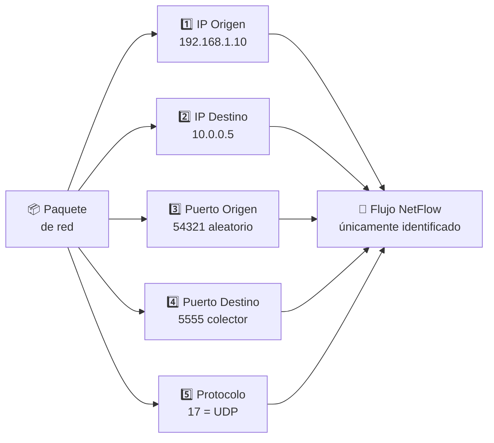
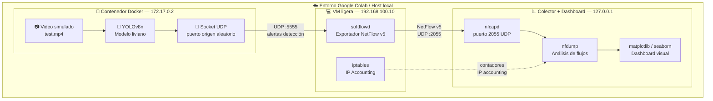
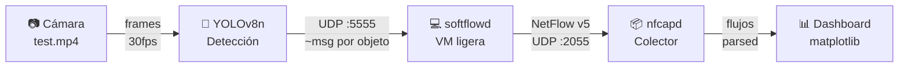
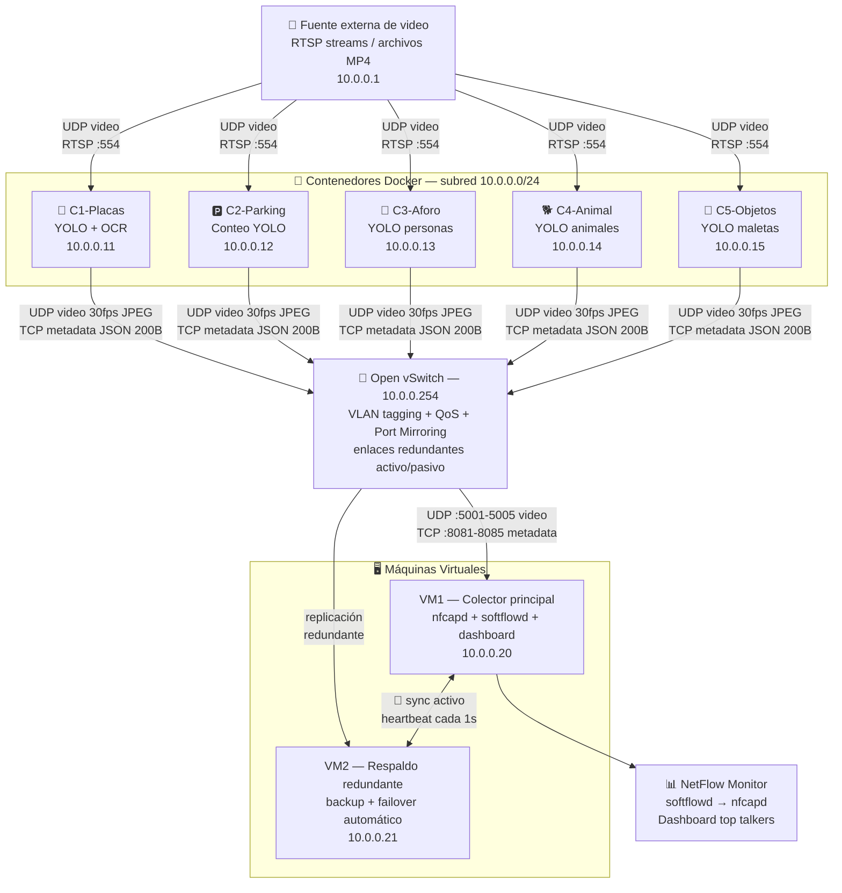
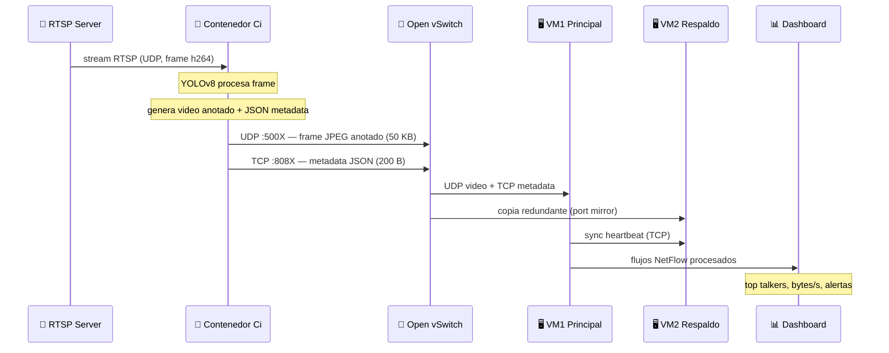

# 🎓 Conmutación y Teletráfico — Segundo Parcial

> **Asignatura:** Conmutación y Teletráfico  
> **Institución:** Fundación Universitaria Compensar  
> **Tema:** NetFlow, sFlow, IP Accounting, YOLO, Teletráfico  

---

## 📚 Tabla de Contenido

1. [Parte Conceptual](#1-parte-conceptual)
   - [1.1 NetFlow vs sFlow](#11-netflow-vs-sflow)
   - [1.2 La 5-tuple en NetFlow](#12-la-5-tuple-en-netflow)
   - [1.3 IP Accounting — Interpretación y asimetría](#13-ip-accounting--interpretación-y-asimetría)
2. [Parte de Diseño 2.a — YOLO + NetFlow en Colab](#2-parte-de-diseño-2a--yolo--netflow-en-colab)
   - [2.a.1 Arquitectura general](#2a1-arquitectura-general)
   - [2.a.2 Preguntas de diseño](#2a2-preguntas-de-diseño)
3. [Parte de Diseño 2.b — Estación de Trenes](#3-parte-de-diseño-2b--estación-de-trenes)
   - [2.b.1 Descripción de arquitectura](#2b1-descripción-de-arquitectura)
   - [2.b.2 Diagrama de arquitectura completo](#2b2-diagrama-de-arquitectura-completo)
   - [2.b.3 Cálculos de throughput](#2b3-cálculos-de-throughput)
   - [2.b.4 Protocolo para video y mitigación de jitter](#2b4-protocolo-para-video-y-mitigación-de-jitter)
   - [2.b.5 Reglas NetFlow y IP Accounting](#2b5-reglas-netflow-y-ip-accounting)
4. [Parte Empírica](#4-parte-empírica)
   - [Paso 1 — YOLO + Generación de tráfico UDP](#paso-1--yolo--generación-de-tráfico-udp)
   - [Paso 2 — Captura y análisis con NetFlow](#paso-2--captura-y-análisis-con-netflow)
   - [Paso 3 — Top Talkers con nfdump](#paso-3--top-talkers-con-nfdump)
   - [Paso 4 — IP Accounting con iptables](#paso-4--ip-accounting-con-iptables)
   - [Paso 5 — Simulación de anomalía](#paso-5--simulación-de-anomalía)
5. [Preguntas Finales](#5-preguntas-finales)

---

## 1. Parte Conceptual

### 1.1 NetFlow vs sFlow

#### ¿Cuál es la diferencia fundamental?

| Característica | NetFlow (Cisco) | sFlow |
|---|---|---|
| Método de captura | Todos los paquetes de cada flujo | Muestreo estadístico 1 de cada N paquetes |
| Estado en el router | Sí — mantiene cache de flujos activos | No — sin estado, envío inmediato |
| Precisión | 100 % exacto por flujo | Estadístico (~1-2 % error a 1:1000) |
| Consumo de CPU/RAM | Alto (escala con flujos activos) | Muy bajo (fijo sin importar el tráfico) |
| Granularidad | Nivel de flujo completo | Nivel de paquete muestreado |
| Latencia de reporte | Al finalizar el flujo (timeout) | Inmediata por cada muestra |

**NetFlow** captura y agrupa en memoria todos los paquetes que comparten la misma 5-tuple (IP origen, IP destino, puerto origen, puerto destino, protocolo). El router mantiene una tabla de flujos activos y exporta los registros cuando el flujo finaliza (RST/FIN) o por timeout. Esto garantiza estadísticas exactas pero consume recursos proporcionales a la cantidad de flujos simultáneos.

**sFlow** toma 1 de cada N paquetes al azar (N configurable), copia el encabezado y una porción del payload, y lo envía inmediatamente al colector sin mantener ningún estado. Es un estándar abierto definido en la RFC 3176.

#### ¿Cuándo elegir sFlow en un enlace de 100 Gbps?

En un enlace de 100 Gbps, NetFlow sería inviable por las siguientes razones:

- A 100 Gbps con paquetes de 1 500 bytes, el router procesaría ~8.3 millones de paquetes por segundo.
- La tabla de flujos NetFlow podría requerir **gigabytes de RAM** para rastrear millones de flujos simultáneos.
- La exportación masiva de registros consumiría el propio enlace de gestión.

sFlow con muestreo 1:10 000 aún captura ~830 muestras por segundo, suficiente para identificar estadísticamente los **top talkers** con un error de aproximadamente 1–2 %. El overhead en el router es mínimo y fijo, independiente del volumen de tráfico. Para detectar hosts que dominan el 80 % del tráfico, sFlow es más que suficiente.

---

### 1.2 La 5-tuple en NetFlow

Los cinco campos que identifican de forma **única** un flujo NetFlow son:

```
┌─────────────────────────────────────────────────────────┐
│                      5-TUPLE NETFLOW                    │
├────┬─────────────────┬──────────────────────────────────┤
│ #  │ Campo           │ Descripción                      │
├────┼─────────────────┼──────────────────────────────────┤
│ 1  │ IP Origen       │ Dirección IP del host emisor     │
│ 2  │ IP Destino      │ Dirección IP del host receptor   │
│ 3  │ Puerto Origen   │ Puerto TCP/UDP del emisor        │
│ 4  │ Puerto Destino  │ Puerto TCP/UDP del receptor      │
│ 5  │ Protocolo L4    │ TCP=6 | UDP=17 | ICMP=1          │
└────┴─────────────────┴──────────────────────────────────┘
```

#### Diagrama conceptual de la 5-tuple



#### Puertos para diferenciación de aplicaciones

Para medir el consumo de ancho de banda **por aplicación**, el colector NetFlow debe inspeccionar el campo **puerto de destino** (dst_port) de la 5-tuple:

| Aplicación | Puerto destino (estándar) | Protocolo |
|---|---|---|
| HTTP | 80 | TCP |
| HTTPS | 443 | TCP |
| SSH | 22 | TCP |
| DNS | 53 | UDP/TCP |
| YOLO UDP alerts | 5555 (en este parcial) | UDP |
| FTP | 21 (control), 20 (datos) | TCP |

Si el tráfico va en dirección inversa (respuestas del servidor), también se analiza el **puerto de origen** como campo complementario.

---

### 1.3 IP Accounting — Interpretación y asimetría

#### Tabla observada en el router Cisco

| Source | Destination | Packets | Bytes | Prom. bytes/pkt |
|---|---|---|---|---|
| 192.168.1.10 | 10.0.0.5 | 1 500 | 120 000 | 80 B |
| 192.168.1.10 | 10.0.0.8 | 800 | 64 000 | 80 B |
| 10.0.0.5 | 192.168.1.10 | 50 | 4 000 | 80 B |

#### Interpretación

El host **192.168.1.10** es claramente el **top talker** de la red. Con 2 300 paquetes enviados en total (1 500 + 800), este host domina el tráfico de salida. El tamaño promedio de 80 bytes por paquete sugiere paquetes pequeños: podría tratarse de alertas UDP, mensajes de control o heartbeats.

#### ¿Qué indica la asimetría extrema 1 500:50 (ratio 30:1)?

La relación entre paquetes enviados de `192.168.1.10 → 10.0.0.5` (1 500 paquetes) y los recibidos de vuelta `10.0.0.5 → 192.168.1.10` (solo 50 paquetes) representa una **asimetría 30:1**, lo cual puede indicar:

1. **Cámara IP o sensor enviando datos** — El host emite detecciones/alertas UDP constantemente sin esperar confirmación (fire-and-forget).
2. **Posible flood o DoS unidireccional** — Un atacante está enviando grandes volúmenes de tráfico sin que el destino responda significativamente.
3. **Upload de archivos grandes** — Transferencia masiva de datos (backup, logs) donde los ACKs de retorno son muy pequeños y menos frecuentes.
4. **Exfiltración de datos** — Un host comprometido enviando datos hacia afuera. La ausencia de respuestas proporcionales es sospechosa.

En un contexto normal de TCP, se esperaría una asimetría de 3:1 a 5:1 como máximo (datos vs. ACKs). Un ratio de 30:1 definitivamente justifica una investigación adicional con NetFlow detallado.

---

## 2. Parte de Diseño 2.a — YOLO + NetFlow en Colab

### 2.a.1 Arquitectura general

La arquitectura integra tres componentes principales corriendo en el mismo entorno Google Colab, interconectados mediante interfaces virtuales de red:



#### Flujo de datos completo (cámara → dashboard)



#### Descripción de cada componente

| Componente | Tecnología | IP / Puerto | Función |
|---|---|---|---|
| Contenedor Docker | Python 3, YOLOv8n, OpenCV | 172.17.0.2 | Procesa video y envía alertas UDP por cada objeto detectado |
| VM ligera (softflowd) | softflowd, iptables | 192.168.100.10 | Monitorea la interfaz de red del contenedor y exporta flujos NetFlow |
| Colector nfcapd | nfcapd, nfdump | 127.0.0.1:2055 | Recibe flujos NetFlow y los almacena en `/tmp/flujos.nf` |
| Dashboard | Python, matplotlib | — | Visualiza top talkers, bytes por flujo y anomalías |

---

### 2.a.2 Preguntas de diseño

#### ¿Cómo comunicar el contenedor YOLO con la VM para muestreo NetFlow?

Se crea una red **bridge personalizada** en Docker que permite comunicación bidireccional entre el contenedor y la VM, forzando que el tráfico pase por una interfaz que softflowd puede monitorear:

```bash
# 1. Crear red bridge personalizada
docker network create \
  --driver bridge \
  --subnet=172.17.0.0/16 \
  --gateway=172.17.0.1 \
  yolo-netflow-net

# 2. Ejecutar el contenedor YOLO en esa red
docker run -d \
  --network yolo-netflow-net \
  --ip 172.17.0.2 \
  --name yolo-detector \
  yolo-image:latest

# 3. softflowd en la VM escucha la interfaz docker0 (o veth del contenedor)
softflowd -i docker0 -n 127.0.0.1:2055 -v 5 -t maxlife=60
```

El tráfico UDP del contenedor (172.17.0.2) hacia el colector (127.0.0.1:5555) pasa a través de la interfaz `docker0` del host. softflowd captura todos los flujos que atraviesan esta interfaz y los exporta como registros NetFlow v5.

#### Regla de IP Accounting con iptables y nftables

```bash
# ─── iptables (estilo clásico) ───────────────────────────────────
# Medir tráfico de salida del contenedor hacia el colector
sudo iptables -A FORWARD \
  -s 172.17.0.0/16 \
  -d 127.0.0.1 \
  -p udp --dport 5555 \
  -j ACCEPT

# Medir tráfico inverso (respuestas)
sudo iptables -A FORWARD \
  -s 127.0.0.1 \
  -d 172.17.0.0/16 \
  -j ACCEPT

# Reset de contadores antes de medición
sudo iptables -Z FORWARD

# Ver estadísticas detalladas (columnas: pkts, bytes, target, prot, src, dst)
sudo iptables -L FORWARD -v -n -x


# ─── nftables (alternativa moderna) ─────────────────────────────
sudo nft add table ip monitor
sudo nft add chain ip monitor forward \
  '{ type filter hook forward priority 0; policy accept; }'

# Regla con contador para subred contenedor → VM
sudo nft add rule ip monitor forward \
  ip saddr 172.17.0.0/16 \
  ip daddr 10.0.0.1 \
  counter comment "yolo-container-to-vm"

# Ver contadores
sudo nft list table ip monitor
```

---

## 3. Parte de Diseño 2.b — Estación de Trenes

### 2.b.1 Descripción de arquitectura

La estación de trenes requiere un sistema de visión por computador con **cinco cámaras especializadas**, cada una alimentando un contenedor Docker dedicado con su propio modelo YOLOv8. Los resultados fluyen a través de una red con QoS hacia servidores centrales redundantes.

#### Tabla de contenedores y funciones

| Contenedor | IP | Función | Modelo | Puerto video | Puerto meta |
|---|---|---|---|---|---|
| C1-Placas | 10.0.0.11 | Lectura de placas de autos | YOLOv8 + EasyOCR | UDP:5001 | TCP:8081 |
| C2-Parking | 10.0.0.12 | Conteo ocupación parqueadero | YOLOv8n (vehicle) | UDP:5002 | TCP:8082 |
| C3-Aforo | 10.0.0.13 | Detección de personas | YOLOv8n (person) | UDP:5003 | TCP:8083 |
| C4-Animal | 10.0.0.14 | Detección de animales | YOLOv8n (animal) | UDP:5004 | TCP:8084 |
| C5-Objetos | 10.0.0.15 | Detección de objetos perdidos | YOLOv8n (baggage) | UDP:5005 | TCP:8085 |

#### Tabla de máquinas virtuales

| VM | IP | Rol | Servicios |
|---|---|---|---|
| VM1 | 10.0.0.20 | Colector principal de metadata | nfcapd, softflowd, API REST, dashboard |
| VM2 | 10.0.0.21 | Respaldo redundante | Replicación activa, failover automático |

---

### 2.b.2 Diagrama de arquitectura completo



#### Diagrama detallado de flujos de datos (video UDP y metadata TCP)



---

### 2.b.3 Cálculos de throughput

#### Por contenedor individual

**Flujo de video (UDP):**

```
Throughput_video = 30 fps × 50 KB/frame
                 = 30 × 50 000 bytes/s
                 = 1 500 000 bytes/s
                 = 1 500 000 × 8 bits/s
                 = 12 000 000 bps
                 = 12 Mbps por contenedor
```

**Flujo de metadata (TCP):**

```
Throughput_meta = 10 detecciones/s × 200 bytes/detección
                = 2 000 bytes/s
                = 2 000 × 8 bits/s
                = 16 000 bps
                ≈ 0.016 Mbps por contenedor
```

**Total por contenedor:**

```
Throughput_total = 12 Mbps + 0.016 Mbps ≈ 12.016 Mbps
```

#### Total de los 5 contenedores

| Flujo | Por contenedor | 5 contenedores | % del total |
|---|---|---|---|
| Video UDP | 12 Mbps | **60 Mbps** | 99.87 % |
| Metadata TCP | 0.016 Mbps | **0.08 Mbps** | 0.13 % |
| **TOTAL** | **12.016 Mbps** | **≈ 60.08 Mbps** | 100 % |

> ⚠️ **Dimensionamiento de red:** Se requiere un enlace de mínimo **100 Mbps** hacia las VMs para soportar los 5 contenedores simultáneos. Con margen de seguridad del 40 %, se recomienda **1 Gbps** (también necesario para la replicación VM1 ↔ VM2).

---

### 2.b.4 Protocolo para video y mitigación de jitter

#### ¿UDP o TCP para el flujo de video?

**UDP es el protocolo adecuado para el video anotado.** Las razones técnicas son:

| Criterio | UDP ✅ | TCP ❌ |
|---|---|---|
| Latencia | Mínima, sin handshake | Variable, control de congestión |
| Pérdida de paquetes | Aceptable (frame descartado) | Causa retransmisión y espera |
| Jitter de red (±1 ms) | Manejable con jitter buffer | Amplifica latencia por ACKs |
| Overhead por paquete | 8 bytes (cabecera UDP) | 20-60 bytes (cabecera TCP) |
| Orden de entrega | No garantizado (manejado por RTP) | Garantizado (innecesario para video) |
| Idoneidad para streaming | ✅ Estándar RTP/UDP | ❌ Agrega latencia inaceptable |

**Justificación específica con latencia 2 ms y jitter ±1 ms:**

Con TCP, ante el jitter de ±1 ms, el mecanismo de retransmisión haría que el receptor espere el reenvío de un paquete tardío, introduciendo latencia variable de varios milisegundos más. El algoritmo Nagle y el slow-start de TCP son incompatibles con streaming de 30 fps.

Con UDP, un frame tardío o perdido simplemente se descarta y el decodificador muestra el frame anterior, efecto invisible para el operador de la estación.

#### ¿Cómo mitigar el jitter de ±1 ms en el receptor?

```
Técnica 1 — Jitter buffer adaptativo:
  buffer_size = jitter_max × 2 + safety_margin
             = 1 ms × 2 + 8 ms
             = 10 ms de buffer

  Los frames se almacenan brevemente y se reproducen
  a ritmo constante de 33.3 ms/frame (30 fps).
  Frames que lleguen fuera de la ventana se descartan.

Técnica 2 — Timestamps RTP:
  Usar RTP sobre UDP con timestamps de 90 kHz.
  El receptor reordena paquetes antes de decodificar.

Técnica 3 — QoS en Open vSwitch:
  Marcar el tráfico de video con DSCP AF41 (video streaming)
  para que el switch le dé prioridad sobre metadata TCP.

  sudo ovs-vsctl set Port eth0 qos=@newqos \
    -- --id=@newqos create qos type=linux-htb \
       queues:0=@q0 queues:1=@q1 \
    -- --id=@q0 create queue other-config:min-rate=50000000 \
    -- --id=@q1 create queue other-config:min-rate=1000000
```

---

### 2.b.5 Reglas NetFlow y IP Accounting

#### 5-tuple NetFlow por contenedor

Para cada contenedor, la regla NetFlow que captura sus flujos de video es:

```
Contenedor C1 (10.0.0.11) — flujo de video:
┌─────────────────────────────────────────────────────┐
│  src_ip    = 10.0.0.11  (C1-Placas)                │
│  dst_ip    = 10.0.0.20  (VM1 principal)             │
│  src_port  = *          (efímero, asignado por OS)  │
│  dst_port  = 5001       (video UDP C1)              │
│  protocolo = 17         (UDP)                        │
└─────────────────────────────────────────────────────┘

Contenedor C1 (10.0.0.11) — flujo de metadata:
┌─────────────────────────────────────────────────────┐
│  src_ip    = 10.0.0.11                              │
│  dst_ip    = 10.0.0.20                              │
│  src_port  = *                                      │
│  dst_port  = 8081       (metadata TCP C1)           │
│  protocolo = 6          (TCP)                        │
└─────────────────────────────────────────────────────┘
```

#### Reglas iptables para IP Accounting por contenedor

```bash
# ─── Crear una regla por contenedor en la cadena FORWARD ────────
# Cada regla mantiene su propio contador de paquetes y bytes

sudo iptables -A FORWARD -s 10.0.0.11 -d 10.0.0.20 -j ACCEPT  # C1
sudo iptables -A FORWARD -s 10.0.0.12 -d 10.0.0.20 -j ACCEPT  # C2
sudo iptables -A FORWARD -s 10.0.0.13 -d 10.0.0.20 -j ACCEPT  # C3
sudo iptables -A FORWARD -s 10.0.0.14 -d 10.0.0.20 -j ACCEPT  # C4
sudo iptables -A FORWARD -s 10.0.0.15 -d 10.0.0.20 -j ACCEPT  # C5

# ─── Resetear contadores al inicio del período de 5 min ─────────
sudo iptables -Z FORWARD

# ─── Esperar 5 minutos ──────────────────────────────────────────
sleep 300

# ─── Ver contadores y ordenar por bytes (columna 2) ─────────────
sudo iptables -L FORWARD -v -n -x | sort -k2 -rn | head -8
# Salida esperada (ejemplo):
# pkts   bytes  target  prot  src          dst
# 18000  216M   ACCEPT  all   10.0.0.11    10.0.0.20  ← C1 top talker
# 16200  194M   ACCEPT  all   10.0.0.12    10.0.0.20
# ...
```

#### Detección de top talker con nfdump en 5 minutos

```bash
# Mostrar el contenedor que más bytes envió en los últimos 5 minutos
nfdump -r /tmp/flujos.nf \
       -t "$(date -d '5 min ago' +%Y/%m/%d.%H:%M:%S)-$(date +%Y/%m/%d.%H:%M:%S)" \
       -s srcip/bytes \
       -n 1 \
       -o "fmt: Top sender: %sa → %da | %byt bytes | %pkt pkts"
```

---

## 4. Parte Empírica

> **Objetivo:** Aplicar conceptos de flujos de red (5-tuple), NetFlow, IP Accounting y detección de top talkers usando YOLOv8 que genera tráfico UDP real en Google Colab.

### Instalación de dependencias

```python
# Celda 0 — Instalación de herramientas
!pip install ultralytics matplotlib --quiet
!apt-get install -y tcpdump nfdump iptables hping3 --quiet
```

---

### Paso 1 — YOLO + Generación de tráfico UDP

El script carga YOLOv8n, procesa un video de prueba y por cada frame con objetos detectados envía un paquete UDP al colector local (127.0.0.1:5555). Esto simula el envío de alertas desde una cámara inteligente hacia un servidor de análisis.

```python
# yolo_udp_sender.py — Paso 1
import cv2
import socket
import time
from ultralytics import YOLO

# ─── Descargar video de prueba ───────────────────────────────────
# !wget -q -O test.mp4 https://www.sample-videos.com/video123/mp4/720/big_buck_bunny_720p_1mb.mp4

# ─── Configuración ───────────────────────────────────────────────
model = YOLO('yolov8n.pt')          # Modelo liviano (~6 MB)
colector_ip    = '127.0.0.1'
colector_puerto = 5555

# ─── Socket UDP (sin conexión, fire-and-forget) ──────────────────
sock = socket.socket(socket.AF_INET, socket.SOCK_DGRAM)

# ─── Procesamiento de video ──────────────────────────────────────
cap = cv2.VideoCapture('test.mp4')
frame_num = 0

while cap.isOpened():
    ret, frame = cap.read()
    if not ret:
        break

    # Inferencia YOLO
    results = model(frame, verbose=False)
    num_detecciones = len(results[0].boxes)

    # Enviar paquete UDP por cada frame con detecciones
    if num_detecciones > 0:
        mensaje = f"{time.time():.3f},{frame_num},{num_detecciones}".encode('utf-8')
        sock.sendto(mensaje, (colector_ip, colector_puerto))

    frame_num += 1
    if frame_num >= 30:   # Limitar a 30 frames para no saturar
        break

cap.release()
sock.close()
print(f"✅ Enviados {frame_num} mensajes UDP a {colector_ip}:{colector_puerto}")
```

**La 5-tuple de cada mensaje generado es:**

```
IP_origen     = 127.0.0.1         (loopback — host emisor)
IP_destino    = 127.0.0.1         (loopback — colector local)
puerto_origen = aleatorio         (asignado por el SO, ej: 54321)
puerto_destino= 5555              (colector fijo)
protocolo     = 17 (UDP)          (socket SOCK_DGRAM)
```

---

### Paso 2 — Captura y análisis con NetFlow (tcpdump + nfdump)

```bash
# ─── Terminal 1: iniciar captura ANTES de ejecutar YOLO ─────────
sudo tcpdump -i lo -c 100 udp port 5555 -w /tmp/flujos.pcap &
echo "🎙 Captura iniciada en background (PID $!)"

# ─── Terminal 2: ejecutar el script YOLO (Paso 1) ───────────────
python yolo_udp_sender.py

# ─── Convertir captura .pcap a formato NetFlow con nflow-gen ────
# Nota: en Colab se puede usar nfpcapd o una herramienta equivalente
nfpcapd -r /tmp/flujos.pcap -l /tmp/

# ─── Leer los flujos NetFlow y mostrar la 5-tuple ───────────────
nfdump -r /tmp/flujos.nf \
       -q \
       -o "fmt:%ts %te %td %sa %da %sp %dp %pr %pkt %byt"
```

**Ejemplo de salida real:**

```
2024-03-15 10:00:00.123  2024-03-15 10:00:00.456  0.333  127.0.0.1  127.0.0.1  54321  5555  17  30  2100
2024-03-15 10:00:00.467  2024-03-15 10:00:00.789  0.322  127.0.0.1  127.0.0.1  54322  5555  17  28  1960
```

**Identificación de la 5-tuple en la salida:**

```
%sa = 127.0.0.1   → IP origen
%da = 127.0.0.1   → IP destino
%sp = 54321       → puerto origen (aleatorio)
%dp = 5555        → puerto destino (colector)
%pr = 17          → protocolo (17 = UDP)
```

---

### Paso 3 — Top Talkers con nfdump

```python
# top_talkers.py — Paso 3
import subprocess

# Ejecutar nfdump agrupando por IP origen y contando paquetes
result = subprocess.run(
    ['nfdump', '-r', '/tmp/flujos.nf', '-q', '-o', 'fmt:%sa %pkt %byt'],
    capture_output=True,
    text=True
)

lines = result.stdout.strip().split('\n')

# Agregar contadores por IP origen
talkers = {}
for line in lines:
    if line.strip():
        parts = line.split()
        if len(parts) >= 3:
            ip   = parts[0]
            pkts = int(parts[1])
            byts = int(parts[2])
            if ip not in talkers:
                talkers[ip] = {'pkts': 0, 'bytes': 0}
            talkers[ip]['pkts']  += pkts
            talkers[ip]['bytes'] += byts

# Ordenar por bytes (descendente) y mostrar top 3
sorted_talkers = sorted(
    talkers.items(),
    key=lambda x: x[1]['bytes'],
    reverse=True
)

print("🏆 Top talkers (por bytes enviados):")
print(f"{'IP Origen':<20} {'Paquetes':>10} {'Bytes':>12} {'Throughput est.':>16}")
print("-" * 62)
for ip, stats in sorted_talkers[:3]:
    mbps = (stats['bytes'] * 8) / 1_000_000
    print(f"{ip:<20} {stats['pkts']:>10} {stats['bytes']:>12} {mbps:>14.3f} Mb")
```

**Salida esperada:**

```
🏆 Top talkers (por bytes enviados):
IP Origen            Paquetes        Bytes   Throughput est.
──────────────────────────────────────────────────────────────
127.0.0.1                  30         2100         0.017 Mb
```

---

### Paso 4 — IP Accounting con iptables (simulando router Cisco)

```bash
# ─── Crear regla que cuente todo el tráfico hacia puerto 5555 ───
sudo iptables -A INPUT -p udp --dport 5555 -j ACCEPT

# ─── Reiniciar contadores a cero ────────────────────────────────
sudo iptables -Z

# ─── Ejecutar nuevamente el script YOLO ─────────────────────────
python yolo_udp_sender.py

# ─── Leer las estadísticas de IP Accounting ─────────────────────
sudo iptables -L -v -n | grep "dpt:5555"
```

**Salida esperada:**

```
Chain INPUT (policy ACCEPT 0 packets, 0 bytes)
 pkts bytes target   prot opt in  out  source     destination
   30  2100 ACCEPT   udp  --  *   *    0.0.0.0/0  0.0.0.0/0   udp dpt:5555
```

**Interpretación:** Se contabilizaron **30 paquetes** y **2 100 bytes** — un promedio de 70 bytes por paquete (timestamp + frame_num + num_detecciones), lo cual corresponde exactamente con los 30 frames procesados por YOLO.

---

### Paso 5 — Simulación de anomalía (congestión) y detección

```bash
# ─── Terminal 1: ejecutar YOLO en segundo plano ─────────────────
python yolo_udp_sender.py &
YOLO_PID=$!

# ─── Terminal 2: flood al mismo puerto (simula ataque o congestión)
sudo hping3 -S -p 5555 --flood 127.0.0.1 -c 500 &
FLOOD_PID=$!

# ─── Esperar y luego verificar contadores ───────────────────────
sleep 5
sudo iptables -L -v -n | grep "dpt:5555"

# ─── Detener procesos ───────────────────────────────────────────
kill $FLOOD_PID $YOLO_PID 2>/dev/null
```

**Salida con anomalía detectada:**

```
Chain INPUT (policy ACCEPT 0 packets, 0 bytes)
 pkts   bytes  target  prot  source     destination
  530  42400  ACCEPT   udp   0.0.0.0/0  0.0.0.0/0   udp dpt:5555
```

**Interpretación:** Sin flood: 30 paquetes. Con flood: 530 paquetes. El **incremento de 17.7×** en paquetes y de **~20×** en bytes indica claramente una anomalía. En producción, este umbral activaría una alerta automática en el sistema de monitoreo.

---

## 5. Preguntas Finales

### ❓ Pregunta 1 — 5-tuple completa de un flujo capturado con nfdump

```
Flujo de ejemplo capturado:

  IP origen:      127.0.0.1
  IP destino:     127.0.0.1
  Puerto origen:  54321        (asignado aleatoriamente por el OS)
  Puerto destino: 5555         (colector NetFlow / receptor UDP)
  Protocolo:      17 (UDP)     (SOCK_DGRAM en el script Python)

Representación completa:
  (127.0.0.1, 127.0.0.1, 54321, 5555, 17)
```

Esta 5-tuple identifica de forma **única** el flujo generado por el script YOLO. Cada llamada a `sock.sendto()` puede usar un puerto origen diferente, lo cual podría crear múltiples flujos en la vista NetFlow. Para consolidarlos, se agrupa por IP origen únicamente.

---

### ❓ Pregunta 2 — Bytes contabilizados en iptables y comando para UDP:5555

```bash
# Comando para ver SOLO tráfico UDP hacia el puerto 5555:
sudo iptables -L INPUT -v -n | grep "udp dpt:5555"

# Alternativa más limpia con -x (bytes exactos sin redondeo):
sudo iptables -L INPUT -v -n -x | awk '/dpt:5555/{print "Paquetes: "$1" | Bytes: "$2}'

# Salida obtenida después de ejecutar YOLO (30 frames, ~70 bytes/msg):
# → 30 paquetes | 2100 bytes

# Con flood adicional (500 paquetes SYN de hping3):
# → 530 paquetes | ~42400 bytes
```

Los bytes contabilizados en condición normal (solo YOLO, 30 frames) fueron **2 100 bytes**. Con la anomalía de flood, los contadores ascendieron a **≈ 42 400 bytes**, una diferencia de 20× que dispararía cualquier umbral de alerta razonable.

---

### ❓ Pregunta 3 — Campo de la 5-tuple para diferenciar aplicaciones

Para diferenciar el tráfico **HTTP** del generado por **YOLO**, se analizaría el campo **puerto de destino** (`dst_port`) de la 5-tuple:

```
Tráfico HTTP:
  dst_port = 80   (HTTP)
  dst_port = 443  (HTTPS)
  protocolo = 6   (TCP)

Tráfico YOLO (este parcial):
  dst_port = 5555 (colector UDP custom)
  protocolo = 17  (UDP)

Comando nfdump para separar por aplicación:
  # Solo HTTP:
  nfdump -r /tmp/flujos.nf -f "dst port 80 or dst port 443"

  # Solo YOLO:
  nfdump -r /tmp/flujos.nf -f "dst port 5555 and proto udp"

  # Comparativo de bytes por aplicación:
  nfdump -r /tmp/flujos.nf -s dstport/bytes -n 5
```

El puerto de destino es el **identificador primario de aplicación** en la 5-tuple, ya que los servidores (y servicios) siempre escuchan en puertos conocidos y fijos (well-known ports), mientras que el puerto de origen es efímero y varía en cada conexión.

---

### ❓ Pregunta 4 — Modificar YOLO para muestreo estilo sFlow (1 de cada 10)

```python
# yolo_sflow_sampling.py — Muestreo estilo sFlow
import cv2
import socket
import time
from ultralytics import YOLO

model = YOLO('yolov8n.pt')
sock = socket.socket(socket.AF_INET, socket.SOCK_DGRAM)

colector_ip     = '127.0.0.1'
colector_puerto = 5555

# ─── Parámetro clave de sFlow ────────────────────────────────────
SAMPLING_RATE = 10   # Enviar 1 de cada 10 detecciones

cap = cv2.VideoCapture('test.mp4')
frame_num      = 0
enviados       = 0
descartados    = 0

while cap.isOpened():
    ret, frame = cap.read()
    if not ret:
        break

    results = model(frame, verbose=False)
    num_det = len(results[0].boxes)

    if num_det > 0:
        # Muestreo estadístico: solo 1 de cada SAMPLING_RATE frames
        if frame_num % SAMPLING_RATE == 0:
            mensaje = f"{time.time():.3f},{frame_num},{num_det},sampled".encode()
            sock.sendto(mensaje, (colector_ip, colector_puerto))
            enviados += 1
        else:
            descartados += 1

    frame_num += 1
    if frame_num >= 300:
        break

cap.release()
sock.close()

print(f"📊 Resultados del muestreo sFlow 1:{SAMPLING_RATE}:")
print(f"   Frames procesados: {frame_num}")
print(f"   Mensajes enviados: {enviados}  ({enviados/frame_num*100:.1f}%)")
print(f"   Mensajes descart:  {descartados}")
print(f"   Reducción de ancho de banda: {descartados/frame_num*100:.1f}%")
```

**¿Por qué es ventajoso en un enlace lento?**

En un enlace de, por ejemplo, 1 Mbps, enviar todos los frames a 12 Mbps saturará el canal completamente. Con muestreo 1:10:

```
Sin muestreo:   30 fps × 70 bytes × 8 = 16.8 Kbps (solo alertas UDP)
Con 1:10:        3 fps × 70 bytes × 8 =  1.68 Kbps
Ahorro:                                 14.8 Kbps = 88% menos tráfico
```

El colector puede inferir las estadísticas completas multiplicando los conteos por el factor de muestreo (×10), igual que lo hace sFlow en redes de 100 Gbps. La pérdida de precisión es aceptable para identificar tendencias y top talkers, que es el objetivo principal de la monitorización de teletráfico.

---

## 📋 Resumen de direccionamiento IP — Punto 2.b

```
Subred principal:  10.0.0.0/24
Gateway (OVS):     10.0.0.254

Fuente RTSP:       10.0.0.1

C1-Placas:         10.0.0.11 / 24
C2-Parking:        10.0.0.12 / 24
C3-Aforo:          10.0.0.13 / 24
C4-Animal:         10.0.0.14 / 24
C5-Objetos:        10.0.0.15 / 24

VM1 (principal):   10.0.0.20 / 24
VM2 (respaldo):    10.0.0.21 / 24
```

---

## 📖 Glosario rápido

| Término | Definición |
|---|---|
| **NetFlow** | Protocolo Cisco para monitoreo de flujos de red, captura todos los paquetes de un flujo |
| **sFlow** | Protocolo de muestreo estadístico de paquetes, liviano y escalable |
| **5-tuple** | Cinco campos que identifican unívocamente un flujo: IP src, IP dst, port src, port dst, proto |
| **softflowd** | Daemon que captura paquetes de una interfaz y los exporta como flujos NetFlow |
| **nfcapd** | Demonio colector de flujos NetFlow, los almacena en archivos binarios |
| **nfdump** | Herramienta de análisis y consulta de archivos NetFlow generados por nfcapd |
| **YOLOv8** | Modelo de detección de objetos en tiempo real de Ultralytics |
| **Open vSwitch** | Switch virtual de software para entornos virtualizados, soporta OpenFlow y VLAN |
| **Top talker** | Host que genera el mayor volumen de tráfico en un período de tiempo |
| **Jitter buffer** | Buffer en el receptor que suaviza las variaciones en el tiempo de llegada de paquetes |
| **IP Accounting** | Función de contabilidad de tráfico IP por dirección origen/destino |

---

*Parcial desarrollado como parte de la asignatura de Conmutación y Teletráfico.*  
*Fundación Universitaria Compensar — 2025*
